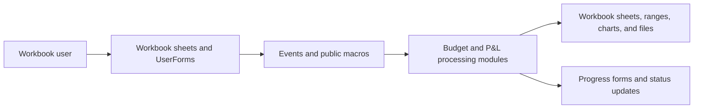

# Corporate VBA Documentation

**Source workbook:** `Testing/Journal20Template20v3.xlsm`  
**Export folder:** `Budget/Corporate/exported_vba`

This documentation is based on static analysis. The macros were not executed in Excel.
Mermaid-compatible Markdown viewers render the flowcharts below.

## System Overview

The source project originally contained 59 VBA components: 9 standard modules, 45 workbook/worksheet class modules, and 5 UserForms. The manual-import export retains the 9 standard modules, the executable `ThisWorkbook` document module, and all 5 UserForms with their binary companions. These components contain 161 procedures and 158 direct internal call relationships. The 44 empty worksheet modules are omitted.

## Main Call Flow

The diagram includes internal calls detected directly in procedure bodies. Dynamic calls through `Application.Run`, worksheet formulas, control bindings, or string-built names may not appear.

```mermaid
flowchart TD
    NBulkWriteGtoRbyDept["BulkWriteGtoRbyDept"] --> NApplyFormulaRange["ApplyFormulaRange"]
    NCopySourceSheets["CopySourceSheets"] --> NBreakAllExternalLinks["BreakAllExternalLinks"]
    NCopySourceSheets["CopySourceSheets"] --> NFilterBudgetAndActualSheets["FilterBudgetAndActualSheets"]
    NCopySourceSheets["CopySourceSheets"] --> NFixButtonMacroAssignments["FixButtonMacroAssignments"]
    NCopySourceSheets["CopySourceSheets"] --> NhideSpecificSheets["hideSpecificSheets"]
    NExportByDepartment["ExportByDepartment"] --> NexportPnLs["exportPnLs"]
    NExportByGroup["ExportByGroup"] --> NexportPnLs["exportPnLs"]
    NexportPnLs["exportPnLs"] --> NApplyFilterSheetsToActiveSheet["ApplyFilterSheetsToActiveSheet"]
    NexportPnLs["exportPnLs"] --> NBuildMasterDictionary["BuildMasterDictionary"]
    NexportPnLs["exportPnLs"] --> NBulkBreakLinksAllSheets["BulkBreakLinksAllSheets"]
    NexportPnLs["exportPnLs"] --> NBulkRemoveControlsAllSheets["BulkRemoveControlsAllSheets"]
    NexportPnLs["exportPnLs"] --> NClearPNL["ClearPNL"]
    NexportPnLs["exportPnLs"] --> NclearTabColor["clearTabColor"]
    NexportPnLs["exportPnLs"] --> NcollapseSetupSheet["collapseSetupSheet"]
    NexportPnLs["exportPnLs"] --> NCopyAllVBAModules["CopyAllVBAModules"]
    NexportPnLs["exportPnLs"] --> NCopySourceSheets["CopySourceSheets"]
    NexportPnLs["exportPnLs"] --> NdeclareGlobal["declareGlobal"]
    NexportPnLs["exportPnLs"] --> NHardCodeFormulasInSourceSheets["HardCodeFormulasInSourceSheets"]
    NexportPnLs["exportPnLs"] --> NhideSpecificSheetsOther["hideSpecificSheetsOther"]
    NexportPnLs["exportPnLs"] --> NLockIndividualPLSheets["LockIndividualPLSheets"]
    NexportPnLs["exportPnLs"] --> NLockSummarySheets["LockSummarySheets"]
    NexportPnLs["exportPnLs"] --> NPutMacroInButton["PutMacroInButton"]
    NexportPnLs["exportPnLs"] --> NUnhideButtons["UnhideButtons"]
    NexportPnLs["exportPnLs"] --> NUpdatePnLForExportedSheets["UpdatePnLForExportedSheets"]
    NFillChildNodes["FillChildNodes"] --> NFillSubChildNodes["FillSubChildNodes"]
    NFillSubChildNodes["FillSubChildNodes"] --> NFillSubSubChildNodes["FillSubSubChildNodes"]
    NFillSubSubChildNodes["FillSubSubChildNodes"] --> NFillSubSubSubChildNodes["FillSubSubSubChildNodes"]
    NFilterBudgetAndActualSheets["FilterBudgetAndActualSheets"] --> NFilterSheetByDepartment["FilterSheetByDepartment"]
    NgetActualFYFiveYearMappingDict["getActualFYFiveYearMappingDict"] --> NdeclareGlobal["declareGlobal"]
    NgetActualFYSummaryDict["getActualFYSummaryDict"] --> NdeclareGlobal["declareGlobal"]
    NgetAllManualChanges["getAllManualChanges"] --> NLockAllSheets["LockAllSheets"]
    NgetAllManualChanges["getAllManualChanges"] --> NunhideSpecificSheets["unhideSpecificSheets"]
    NgetAllManualChanges["getAllManualChanges"] --> NupdateManualExportedSheet["updateManualExportedSheet"]
    NgetAllManualChanges["getAllManualChanges"] --> NupdatePnL["updatePnL"]
    NgetBudgetFYFiveYearMappingDict["getBudgetFYFiveYearMappingDict"] --> NdeclareGlobal["declareGlobal"]
    NgetBudgetFYSummaryDict["getBudgetFYSummaryDict"] --> NdeclareGlobal["declareGlobal"]
    NgroupActual["groupActual"] --> NdeclareGlobal["declareGlobal"]
    NgroupActual["groupActual"] --> NgroupData["groupData"]
    NgroupBudgetFY["groupBudgetFY"] --> NdeclareGlobal["declareGlobal"]
    NgroupBudgetFY["groupBudgetFY"] --> NgroupData["groupData"]
    NgroupData["groupData"] --> NdeclareGlobal["declareGlobal"]
    NHardCodeFormulasInSourceSheets["HardCodeFormulasInSourceSheets"] --> NHardCodeFormulasInSheet["HardCodeFormulasInSheet"]
    NLockAllSheets["LockAllSheets"] --> NLockIndividualPLSheets["LockIndividualPLSheets"]
    NLockAllSheets["LockAllSheets"] --> NLockSummarySheets["LockSummarySheets"]
    NnewRows["newRows"] --> NdeclareGlobal["declareGlobal"]
    NnewRows["newRows"] --> NProcessAdjustmentTransaction["ProcessAdjustmentTransaction"]
    NnewRows["newRows"] --> NProcessGlobalSheetCell["ProcessGlobalSheetCell"]
    NnewRows["newRows"] --> NSetGlobalFYSheetValues["SetGlobalFYSheetValues"]
    NnewRows["newRows"] --> NWriteBulkBudgetData["WriteBulkBudgetData"]
    NnewRowsActual["newRowsActual"] --> NdeclareGlobal["declareGlobal"]
    NnewRowsActual["newRowsActual"] --> NProcessActualAdjustmentTransaction["ProcessActualAdjustmentTransaction"]
    NnewRowsActual["newRowsActual"] --> NProcessActualSheetCell["ProcessActualSheetCell"]
    NnewRowsActual["newRowsActual"] --> NSetGlobalFYSheetValues["SetGlobalFYSheetValues"]
    NnewRowsActual["newRowsActual"] --> NWriteBulkActualData["WriteBulkActualData"]
    NOverAllPnl["OverAllPnl"] --> NupdatePnL["updatePnL"]
    NpopulateSetupActualTotals["populateSetupActualTotals"] --> NdeclareGlobal["declareGlobal"]
    NpopulateSetupBudgetTotals["populateSetupBudgetTotals"] --> NdeclareGlobal["declareGlobal"]
    NpopulateWSActualTotals["populateWSActualTotals"] --> NdeclareGlobal["declareGlobal"]
    NpopulateWSBudgetTotals["populateWSBudgetTotals"] --> NdeclareGlobal["declareGlobal"]
    NProcessActualSheetCell["ProcessActualSheetCell"] --> NUpdateActualDictionaryValue["UpdateActualDictionaryValue"]
    NProcessGlobalSheetCell["ProcessGlobalSheetCell"] --> NUpdateDictionaryValue["UpdateDictionaryValue"]
    NProcessSpecialWinRows["ProcessSpecialWinRows"] --> NProcessDynamicWinRowMultiple["ProcessDynamicWinRowMultiple"]
    NProcessSpecialWinRowsByDept["ProcessSpecialWinRowsByDept"] --> NProcessDynamicWinRowByDeptMultiple["ProcessDynamicWinRowByDeptMultiple"]
    NPutMacroInButton["PutMacroInButton"] --> NLockAllSheets["LockAllSheets"]
    NReadSpecialRowsConfig["ReadSpecialRowsConfig"] --> NAddCriteriaIfExists["AddCriteriaIfExists"]
    NrefreshPnLs["refreshPnLs"] --> NLockAllSheets["LockAllSheets"]
    NrefreshPnLs["refreshPnLs"] --> NupdatePnL["updatePnL"]
    NSetGlobalFYSheetValues["SetGlobalFYSheetValues"] --> NdeclareGlobal["declareGlobal"]
    NTreeview1_NodeClick["Treeview1_NodeClick"] --> NdeclareGlobal["declareGlobal"]
    NUpdateActualFYWithAllocations["UpdateActualFYWithAllocations"] --> NdeclareGlobal["declareGlobal"]
    NUpdateActualFYWithAllocations["UpdateActualFYWithAllocations"] --> NSetGlobalFYSheetValues["SetGlobalFYSheetValues"]
    NUpdateActualFYWithAllocationsNoDept["UpdateActualFYWithAllocationsNoDept"] --> NdeclareGlobal["declareGlobal"]
    NUpdateActualFYWithAllocationsNoDept["UpdateActualFYWithAllocationsNoDept"] --> NSetGlobalFYSheetValues["SetGlobalFYSheetValues"]
    NupdateAssumptionsExcel["updateAssumptionsExcel"] --> NdeclareGlobal["declareGlobal"]
    NupdateAssumptionsExcel["updateAssumptionsExcel"] --> NnewRows["newRows"]
    NupdateAssumptionsExcel["updateAssumptionsExcel"] --> NnewRowsActual["newRowsActual"]
    NupdateAssumptionsForecastExcel["updateAssumptionsForecastExcel"] --> NdeclareGlobal["declareGlobal"]
    NupdateAssumptionsForecastExcel["updateAssumptionsForecastExcel"] --> NnewRows["newRows"]
    NupdateAssumptionsForecastExcel["updateAssumptionsForecastExcel"] --> NnewRowsActual["newRowsActual"]
    NupdateBelowAssumptions["updateBelowAssumptions"] --> NdeclareGlobal["declareGlobal"]
    NupdateBelowAssumptions["updateBelowAssumptions"] --> NUpdateBudgetFYWithAllocationsNoDept["UpdateBudgetFYWithAllocationsNoDept"]
    NupdateBelowForecastAssumptions["updateBelowForecastAssumptions"] --> NdeclareGlobal["declareGlobal"]
    NupdateBelowForecastAssumptions["updateBelowForecastAssumptions"] --> NnewRowsActual["newRowsActual"]
    NupdateBelowForecastAssumptions["updateBelowForecastAssumptions"] --> NUpdateActualFYWithAllocationsNoDept["UpdateActualFYWithAllocationsNoDept"]
    NUpdateBudgetFYWithAllocations["UpdateBudgetFYWithAllocations"] --> NdeclareGlobal["declareGlobal"]
    NUpdateBudgetFYWithAllocations["UpdateBudgetFYWithAllocations"] --> NSetGlobalFYSheetValues["SetGlobalFYSheetValues"]
    NUpdateBudgetFYWithAllocationsNoDept["UpdateBudgetFYWithAllocationsNoDept"] --> NdeclareGlobal["declareGlobal"]
    NUpdateBudgetFYWithAllocationsNoDept["UpdateBudgetFYWithAllocationsNoDept"] --> NSetGlobalFYSheetValues["SetGlobalFYSheetValues"]
    NUpdateBudgetRowsWithAllocation["UpdateBudgetRowsWithAllocation"] --> NCreateNewBudgetRow["CreateNewBudgetRow"]
    NupdateButton_Click["updateButton_Click"] --> NdeclareGlobal["declareGlobal"]
    NupdateButton_Click["updateButton_Click"] --> NupdatePnL["updatePnL"]
    NupdateCompAssumptions["updateCompAssumptions"] --> NdeclareGlobal["declareGlobal"]
    NupdateCompAssumptions["updateCompAssumptions"] --> NUpdateActualFYWithAllocations["UpdateActualFYWithAllocations"]
    NupdateCompAssumptions["updateCompAssumptions"] --> NUpdateBudgetFYWithAllocations["UpdateBudgetFYWithAllocations"]
    NupdateCompForecastAssumptions["updateCompForecastAssumptions"] --> NdeclareGlobal["declareGlobal"]
    NupdateCompForecastAssumptions["updateCompForecastAssumptions"] --> NnewRowsActual["newRowsActual"]
    NupdateCompForecastAssumptions["updateCompForecastAssumptions"] --> NUpdateActualFYWithAllocations["UpdateActualFYWithAllocations"]
    NupdateCompForecastAssumptions["updateCompForecastAssumptions"] --> NUpdateBudgetFYWithAllocations["UpdateBudgetFYWithAllocations"]
    NUpdateKPI["UpdateKPI"] --> NpopulateWSActualTotals["populateWSActualTotals"]
    NUpdateKPI["UpdateKPI"] --> NpopulateWSBudgetTotals["populateWSBudgetTotals"]
    More["39 additional calls listed below"]
```

## Component Inventory

| Component | Type | Procedures |
|---|---|---:|
| `tableContents.frm` | UserForm | 9 |
| `CallOverall.bas` | Standard module | 1 |
| `addItems.frm` | UserForm | 9 |
| `Progress_Bar.frm` | UserForm | 6 |
| `frmWait.frm` | UserForm | 1 |
| `updateBudgetFY.bas` | Standard module | 10 |
| `checkbyDept.bas` | Standard module | 9 |
| `progressCode.bas` | Standard module | 1 |
| `GlobalVariables.bas` | Standard module | 17 |
| `Funcs.bas` | Standard module | 11 |
| `pnLSheet.bas` | Standard module | 68 |
| `viewPL.frm` | UserForm | 9 |
| `Module1.bas` | Standard module | 2 |
| `Module2.bas` | Standard module | 6 |
| `ThisWorkbook.cls` | Workbook document module | 2 |

## Procedure Inventory

| Module | Procedure | Kind | Scope | Role |
|---|---|---|---|---|
| `tableContents.frm` | `Label11_Click` | Sub | Private | Event handler |
| `tableContents.frm` | `Label12_Click` | Sub | Private | Event handler |
| `tableContents.frm` | `updateButton_Click` | Sub | Private | Event handler |
| `tableContents.frm` | `exitButton_Click` | Sub | Private | Event handler |
| `tableContents.frm` | `TreeView1_BeforeLabelEdit` | Sub | Private | Callable routine |
| `tableContents.frm` | `Treeview1_NodeClick` | Sub | Private | Callable routine |
| `tableContents.frm` | `UserForm_Initialize` | Sub | Private | Event handler |
| `tableContents.frm` | `FillChildNodes` | Sub | Public | Callable routine |
| `tableContents.frm` | `FillSubChildNodes` | Sub | Public | Callable routine |
| `CallOverall.bas` | `OverAllPnl` | Sub | Public | Callable routine |
| `addItems.frm` | `clearButton_Click` | Sub | Private | Event handler |
| `addItems.frm` | `updateButton_Click` | Sub | Private | Event handler |
| `addItems.frm` | `exitButton_Click` | Sub | Private | Event handler |
| `addItems.frm` | `TreeView1_BeforeLabelEdit` | Sub | Private | Callable routine |
| `addItems.frm` | `Treeview1_NodeClick` | Sub | Private | Callable routine |
| `addItems.frm` | `UserForm_Initialize` | Sub | Private | Event handler |
| `addItems.frm` | `FillChildNodes` | Sub | Public | Callable routine |
| `addItems.frm` | `FillSubChildNodes` | Sub | Public | Callable routine |
| `addItems.frm` | `ComboBox1_Change` | Sub | Private | Event handler |
| `Progress_Bar.frm` | `ProgressContainer_Click` | Sub | Private | Event handler |
| `Progress_Bar.frm` | `StatusText_Click` | Sub | Private | Event handler |
| `Progress_Bar.frm` | `UserForm_Initialize` | Sub | Private | Event handler |
| `Progress_Bar.frm` | `setStatusText` | Sub | Public | Callable routine |
| `Progress_Bar.frm` | `percentDone` | Sub | Public | Callable routine |
| `Progress_Bar.frm` | `UserForm_QueryClose` | Sub | Private | Event handler |
| `frmWait.frm` | `UserForm_Initialize` | Sub | Private | Event handler |
| `updateBudgetFY.bas` | `updateAssumptionsExcel` | Sub | Public | Callable routine |
| `updateBudgetFY.bas` | `updateAssumptionsForecastExcel` | Sub | Public | Callable routine |
| `updateBudgetFY.bas` | `updateCompAssumptions` | Sub | Public | Callable routine |
| `updateBudgetFY.bas` | `updateCompForecastAssumptions` | Sub | Public | Callable routine |
| `updateBudgetFY.bas` | `updatePayrollAssumptions` | Sub | Public | Callable routine |
| `updateBudgetFY.bas` | `updatePayrollForecastAssumptions` | Sub | Public | Callable routine |
| `updateBudgetFY.bas` | `updateOpexAssumptions` | Sub | Public | Callable routine |
| `updateBudgetFY.bas` | `updateOpexForecastAssumptions` | Sub | Public | Callable routine |
| `updateBudgetFY.bas` | `updateBelowAssumptions` | Sub | Public | Callable routine |
| `updateBudgetFY.bas` | `updateBelowForecastAssumptions` | Sub | Public | Callable routine |
| `checkbyDept.bas` | `getActualFYSummaryDict` | Function | Public | Callable routine |
| `checkbyDept.bas` | `getActualFYFiveYearMappingDict` | Function | Public | Callable routine |
| `checkbyDept.bas` | `populateSetupActualTotals` | Sub | Public | Callable routine |
| `checkbyDept.bas` | `getBudgetFYSummaryDict` | Function | Public | Callable routine |
| `checkbyDept.bas` | `getBudgetFYFiveYearMappingDict` | Function | Public | Callable routine |
| `checkbyDept.bas` | `populateSetupBudgetTotals` | Sub | Public | Callable routine |
| `checkbyDept.bas` | `populateWSActualTotals` | Sub | Public | Callable routine |
| `checkbyDept.bas` | `populateWSBudgetTotals` | Sub | Public | Callable routine |
| `checkbyDept.bas` | `UpdateKPI` | Sub | Public | Callable routine |
| `progressCode.bas` | `showProgress` | Sub | Public | Callable routine |
| `GlobalVariables.bas` | `declareGlobal` | Sub | Public | Callable routine |
| `GlobalVariables.bas` | `manualCategoriesItems` | Sub | Public | Callable routine |
| `GlobalVariables.bas` | `newRows` | Sub | Public | Callable routine |
| `GlobalVariables.bas` | `ProcessGlobalSheetCell` | Sub | Private | Callable routine |
| `GlobalVariables.bas` | `ProcessAdjustmentTransaction` | Sub | Private | Callable routine |
| `GlobalVariables.bas` | `UpdateDictionaryValue` | Sub | Private | Callable routine |
| `GlobalVariables.bas` | `WriteBulkBudgetData` | Sub | Private | Callable routine |
| `GlobalVariables.bas` | `clearBudget` | Sub | Public | Callable routine |
| `GlobalVariables.bas` | `UpdateBudgetFYWithAllocations` | Sub | Public | Callable routine |
| `GlobalVariables.bas` | `UpdateBudgetFYWithAllocationsNoDept` | Sub | Public | Callable routine |
| `GlobalVariables.bas` | `newRowsActual` | Sub | Public | Callable routine |
| `GlobalVariables.bas` | `ProcessActualSheetCell` | Sub | Private | Callable routine |
| `GlobalVariables.bas` | `ProcessActualAdjustmentTransaction` | Sub | Private | Callable routine |
| `GlobalVariables.bas` | `UpdateActualDictionaryValue` | Sub | Private | Callable routine |
| `GlobalVariables.bas` | `WriteBulkActualData` | Sub | Private | Callable routine |
| `GlobalVariables.bas` | `UpdateActualFYWithAllocations` | Sub | Public | Callable routine |
| `GlobalVariables.bas` | `UpdateActualFYWithAllocationsNoDept` | Sub | Public | Callable routine |
| `Funcs.bas` | `ForceFullCalculation` | Sub | Public | Callable routine |
| `Funcs.bas` | `SetUpDataValidation` | Sub | Public | Callable routine |
| `Funcs.bas` | `FilterActualFY` | Sub | Public | Callable routine |
| `Funcs.bas` | `AddXMLReference` | Sub | Public | Callable routine |
| `Funcs.bas` | `choosePL` | Sub | Public | Callable routine |
| `Funcs.bas` | `openTOC` | Sub | Public | Callable routine |
| `Funcs.bas` | `addItemsForm` | Sub | Public | Callable routine |
| `Funcs.bas` | `SetGlobalFYSheetValues` | Sub | Public | Callable routine |
| `Funcs.bas` | `groupData` | Sub | Public | Callable routine |
| `Funcs.bas` | `groupActual` | Sub | Public | Callable routine |
| `Funcs.bas` | `groupBudgetFY` | Sub | Public | Callable routine |
| `pnLSheet.bas` | `GetLastUsedRow` | Function | Private | Dynamic worksheet boundary helper |
| `pnLSheet.bas` | `GetLastDataRow` | Function | Private | Dynamic FY data boundary helper |
| `pnLSheet.bas` | `ValidatePnLTargetRows` | Function | Private | Pre-clear FY-to-P&L mapping validation |
| `pnLSheet.bas` | `ClearPNL` | Sub | Public | Callable routine |
| `pnLSheet.bas` | `ClearDeptPNL` | Sub | Public | Callable routine |
| `pnLSheet.bas` | `updatePnL` | Sub | Public | Callable routine |
| `pnLSheet.bas` | `BulkWriteGtoR` | Sub | Private | Callable routine |
| `pnLSheet.bas` | `BulkWriteWtoAH` | Sub | Private | Callable routine |
| `pnLSheet.bas` | `BulkWriteAVtoBH` | Sub | Private | Callable routine |
| `pnLSheet.bas` | `exportPnLs` | Sub | Public | Callable routine |
| `pnLSheet.bas` | `CleanFilenames` | Function | Private | Callable routine |
| `pnLSheet.bas` | `CleanSheetName` | Function | Private | Callable routine |
| `pnLSheet.bas` | `CopySheetStructureFast` | Function | Private | Callable routine |
| `pnLSheet.bas` | `BulkBreakLinksAllSheets` | Sub | Private | Callable routine |
| `pnLSheet.bas` | `BulkRemoveControlsAllSheets` | Sub | Private | Callable routine |
| `pnLSheet.bas` | `BuildMasterDictionary` | Function | Private | Callable routine |
| `pnLSheet.bas` | `UpdatePnLForExportedSheets` | Sub | Private | Callable routine |
| `pnLSheet.bas` | `BulkWriteToSheet` | Sub | Private | Callable routine |
| `pnLSheet.bas` | `updatePnLbyDept` | Sub | Public | Callable routine |
| `pnLSheet.bas` | `BulkWriteGtoRbyDept` | Sub | Private | Callable routine |
| `pnLSheet.bas` | `ApplyFormulaRange` | Sub | Private | Callable routine |
| `pnLSheet.bas` | `FindRowByText` | Function | Private | Callable routine |
| `pnLSheet.bas` | `ReadSpecialRowsConfig` | Function | Private | Callable routine |
| `pnLSheet.bas` | `AddCriteriaIfExists` | Sub | Private | Callable routine |
| `pnLSheet.bas` | `EvaluateCriteria` | Function | Private | Callable routine |
| `pnLSheet.bas` | `EvaluateSingleCriteria` | Function | Private | Callable routine |
| `pnLSheet.bas` | `ProcessSpecialWinRows` | Sub | Private | Callable routine |
| `pnLSheet.bas` | `ProcessDynamicWinRow` | Sub | Private | Callable routine |
| `pnLSheet.bas` | `ProcessDynamicWinRowMultiple` | Sub | Private | Callable routine |
| `pnLSheet.bas` | `EvaluateRowCriteria` | Function | Private | Callable routine |
| `pnLSheet.bas` | `ProcessSpecialWinRowsByDept` | Sub | Private | Callable routine |
| `pnLSheet.bas` | `ProcessDynamicWinRowByDept` | Sub | Private | Callable routine |
| `pnLSheet.bas` | `ProcessDynamicWinRowByDeptMultiple` | Sub | Private | Callable routine |
| `pnLSheet.bas` | `EvaluateRowCriteriaForDept` | Function | Private | Callable routine |
| `pnLSheet.bas` | `updateManual` | Sub | Public | Callable routine |
| `pnLSheet.bas` | `UpdateBudgetRowsWithAllocation` | Sub | Private | Callable routine |
| `pnLSheet.bas` | `CreateNewBudgetRow` | Sub | Private | Callable routine |
| `pnLSheet.bas` | `WriteBulkBudgetDataManual` | Sub | Private | Callable routine |
| `pnLSheet.bas` | `CopyRowsToOpexTab` | Sub | Private | Callable routine |
| `pnLSheet.bas` | `updateManualExportedSheet` | Sub | Public | Callable routine |
| `pnLSheet.bas` | `ApplyFilterSheetsToActiveSheet` | Sub | Private | Callable routine |
| `pnLSheet.bas` | `CopySourceSheets` | Sub | Private | Callable routine |
| `pnLSheet.bas` | `FilterBudgetAndActualSheets` | Sub | Private | Callable routine |
| `pnLSheet.bas` | `FilterSheetByDepartment` | Sub | Private | Callable routine |
| `pnLSheet.bas` | `FixButtonMacroAssignments` | Sub | Private | Callable routine |
| `pnLSheet.bas` | `BreakAllExternalLinks` | Sub | Private | Callable routine |
| `pnLSheet.bas` | `RemoveExternalLinksInSheets` | Sub | Private | Callable routine |
| `pnLSheet.bas` | `hideSpecificSheets` | Sub | Private | Callable routine |
| `pnLSheet.bas` | `CopyAllVBAModules` | Sub | Private | Callable routine |
| `pnLSheet.bas` | `ExportByDepartment` | Sub | Public | Callable routine |
| `pnLSheet.bas` | `ExportByGroup` | Sub | Public | Callable routine |
| `pnLSheet.bas` | `getAllManualChanges` | Sub | Public | Callable routine |
| `pnLSheet.bas` | `CheckForManualChanges` | Function | Private | Callable routine |
| `pnLSheet.bas` | `HardCodeFormulasInSourceSheets` | Sub | Private | Callable routine |
| `pnLSheet.bas` | `HardCodeFormulasInSheet` | Sub | Private | Callable routine |
| `pnLSheet.bas` | `LockSummarySheets` | Sub | Private | Callable routine |
| `pnLSheet.bas` | `UnlockAllSheets` | Function | Public | Callable routine |
| `pnLSheet.bas` | `UnhideButtons` | Sub | Public | Callable routine |
| `pnLSheet.bas` | `LockIndividualPLSheets` | Sub | Private | Callable routine |
| `pnLSheet.bas` | `LockAllSheets` | Sub | Public | Callable routine |
| `pnLSheet.bas` | `refreshPnLs` | Sub | Public | Callable routine |
| `pnLSheet.bas` | `FilterSheetsNewWorkbook` | Sub | Public | Callable routine |
| `pnLSheet.bas` | `UnfilterActiveSheetNewWorkbook` | Sub | Public | Callable routine |
| `pnLSheet.bas` | `PutMacroInButton` | Sub | Private | Callable routine |
| `pnLSheet.bas` | `clearTabColor` | Sub | Public | Callable routine |
| `pnLSheet.bas` | `hideSpecificSheetsOther` | Sub | Public | Callable routine |
| `pnLSheet.bas` | `unhideSpecificSheets` | Sub | Public | Callable routine |
| `pnLSheet.bas` | `collapseSetupSheet` | Sub | Private | Callable routine |
| `viewPL.frm` | `updateButton_Click` | Sub | Private | Event handler |
| `viewPL.frm` | `exitButton_Click` | Sub | Private | Event handler |
| `viewPL.frm` | `TreeView1_BeforeLabelEdit` | Sub | Private | Callable routine |
| `viewPL.frm` | `Treeview1_NodeClick` | Sub | Private | Callable routine |
| `viewPL.frm` | `UserForm_Initialize` | Sub | Private | Event handler |
| `viewPL.frm` | `FillChildNodes` | Sub | Public | Callable routine |
| `viewPL.frm` | `FillSubChildNodes` | Sub | Public | Callable routine |
| `viewPL.frm` | `FillSubSubChildNodes` | Sub | Public | Callable routine |
| `viewPL.frm` | `FillSubSubSubChildNodes` | Sub | Public | Callable routine |
| `Module1.bas` | `Macro1` | Sub | Public | Callable routine |
| `Module1.bas` | `Macro2` | Sub | Public | Callable routine |
| `Module2.bas` | `Macro3` | Sub | Public | Callable routine |
| `Module2.bas` | `FilterSheets` | Sub | Public | Callable routine |
| `Module2.bas` | `UnfilterActiveSheet` | Sub | Public | Callable routine |
| `Module2.bas` | `Refresh_By_Dept_Graph` | Sub | Public | Callable routine |
| `Module2.bas` | `Refresh_By_Dept_Graph_in_thousands` | Sub | Public | Callable routine |
| `Module2.bas` | `Refresh_Table` | Sub | Public | Callable routine |
| `ThisWorkbook.cls` | `Workbook_Open` | Sub | Private | Workbook event handler |
| `ThisWorkbook.cls` | `RegisterOCX` | Sub | Public | Common Controls registration helper |

## Direct Call Relationships

| Caller | Callee |
|---|---|
| `BulkWriteGtoRbyDept` | `ApplyFormulaRange` |
| `CopySourceSheets` | `BreakAllExternalLinks` |
| `CopySourceSheets` | `FilterBudgetAndActualSheets` |
| `CopySourceSheets` | `FixButtonMacroAssignments` |
| `CopySourceSheets` | `hideSpecificSheets` |
| `ExportByDepartment` | `exportPnLs` |
| `ExportByGroup` | `exportPnLs` |
| `exportPnLs` | `ApplyFilterSheetsToActiveSheet` |
| `exportPnLs` | `BuildMasterDictionary` |
| `exportPnLs` | `BulkBreakLinksAllSheets` |
| `exportPnLs` | `BulkRemoveControlsAllSheets` |
| `exportPnLs` | `ClearPNL` |
| `exportPnLs` | `clearTabColor` |
| `exportPnLs` | `collapseSetupSheet` |
| `exportPnLs` | `CopyAllVBAModules` |
| `exportPnLs` | `CopySourceSheets` |
| `exportPnLs` | `declareGlobal` |
| `exportPnLs` | `HardCodeFormulasInSourceSheets` |
| `exportPnLs` | `hideSpecificSheetsOther` |
| `exportPnLs` | `LockIndividualPLSheets` |
| `exportPnLs` | `LockSummarySheets` |
| `exportPnLs` | `PutMacroInButton` |
| `exportPnLs` | `UnhideButtons` |
| `exportPnLs` | `UpdatePnLForExportedSheets` |
| `FillChildNodes` | `FillSubChildNodes` |
| `FillSubChildNodes` | `FillSubSubChildNodes` |
| `FillSubSubChildNodes` | `FillSubSubSubChildNodes` |
| `FilterBudgetAndActualSheets` | `FilterSheetByDepartment` |
| `getActualFYFiveYearMappingDict` | `declareGlobal` |
| `getActualFYSummaryDict` | `declareGlobal` |
| `getAllManualChanges` | `LockAllSheets` |
| `getAllManualChanges` | `unhideSpecificSheets` |
| `getAllManualChanges` | `updateManualExportedSheet` |
| `getAllManualChanges` | `updatePnL` |
| `getBudgetFYFiveYearMappingDict` | `declareGlobal` |
| `getBudgetFYSummaryDict` | `declareGlobal` |
| `groupActual` | `declareGlobal` |
| `groupActual` | `groupData` |
| `groupBudgetFY` | `declareGlobal` |
| `groupBudgetFY` | `groupData` |
| `groupData` | `declareGlobal` |
| `HardCodeFormulasInSourceSheets` | `HardCodeFormulasInSheet` |
| `LockAllSheets` | `LockIndividualPLSheets` |
| `LockAllSheets` | `LockSummarySheets` |
| `newRows` | `declareGlobal` |
| `newRows` | `ProcessAdjustmentTransaction` |
| `newRows` | `ProcessGlobalSheetCell` |
| `newRows` | `SetGlobalFYSheetValues` |
| `newRows` | `WriteBulkBudgetData` |
| `newRowsActual` | `declareGlobal` |
| `newRowsActual` | `ProcessActualAdjustmentTransaction` |
| `newRowsActual` | `ProcessActualSheetCell` |
| `newRowsActual` | `SetGlobalFYSheetValues` |
| `newRowsActual` | `WriteBulkActualData` |
| `OverAllPnl` | `updatePnL` |
| `populateSetupActualTotals` | `declareGlobal` |
| `populateSetupBudgetTotals` | `declareGlobal` |
| `populateWSActualTotals` | `declareGlobal` |
| `populateWSBudgetTotals` | `declareGlobal` |
| `ProcessActualSheetCell` | `UpdateActualDictionaryValue` |
| `ProcessGlobalSheetCell` | `UpdateDictionaryValue` |
| `ProcessSpecialWinRows` | `ProcessDynamicWinRowMultiple` |
| `ProcessSpecialWinRowsByDept` | `ProcessDynamicWinRowByDeptMultiple` |
| `PutMacroInButton` | `LockAllSheets` |
| `ReadSpecialRowsConfig` | `AddCriteriaIfExists` |
| `refreshPnLs` | `LockAllSheets` |
| `refreshPnLs` | `updatePnL` |
| `SetGlobalFYSheetValues` | `declareGlobal` |
| `Treeview1_NodeClick` | `declareGlobal` |
| `UpdateActualFYWithAllocations` | `declareGlobal` |
| `UpdateActualFYWithAllocations` | `SetGlobalFYSheetValues` |
| `UpdateActualFYWithAllocationsNoDept` | `declareGlobal` |
| `UpdateActualFYWithAllocationsNoDept` | `SetGlobalFYSheetValues` |
| `updateAssumptionsExcel` | `declareGlobal` |
| `updateAssumptionsExcel` | `newRows` |
| `updateAssumptionsExcel` | `newRowsActual` |
| `updateAssumptionsForecastExcel` | `declareGlobal` |
| `updateAssumptionsForecastExcel` | `newRows` |
| `updateAssumptionsForecastExcel` | `newRowsActual` |
| `updateBelowAssumptions` | `declareGlobal` |
| `updateBelowAssumptions` | `UpdateBudgetFYWithAllocationsNoDept` |
| `updateBelowForecastAssumptions` | `declareGlobal` |
| `updateBelowForecastAssumptions` | `newRowsActual` |
| `updateBelowForecastAssumptions` | `UpdateActualFYWithAllocationsNoDept` |
| `UpdateBudgetFYWithAllocations` | `declareGlobal` |
| `UpdateBudgetFYWithAllocations` | `SetGlobalFYSheetValues` |
| `UpdateBudgetFYWithAllocationsNoDept` | `declareGlobal` |
| `UpdateBudgetFYWithAllocationsNoDept` | `SetGlobalFYSheetValues` |
| `UpdateBudgetRowsWithAllocation` | `CreateNewBudgetRow` |
| `updateButton_Click` | `declareGlobal` |
| `updateButton_Click` | `updatePnL` |
| `updateCompAssumptions` | `declareGlobal` |
| `updateCompAssumptions` | `UpdateActualFYWithAllocations` |
| `updateCompAssumptions` | `UpdateBudgetFYWithAllocations` |
| `updateCompForecastAssumptions` | `declareGlobal` |
| `updateCompForecastAssumptions` | `newRowsActual` |
| `updateCompForecastAssumptions` | `UpdateActualFYWithAllocations` |
| `updateCompForecastAssumptions` | `UpdateBudgetFYWithAllocations` |
| `UpdateKPI` | `populateWSActualTotals` |
| `UpdateKPI` | `populateWSBudgetTotals` |
| `updateManual` | `declareGlobal` |
| `updateManual` | `UpdateBudgetRowsWithAllocation` |
| `updateManual` | `updatePnL` |
| `updateManual` | `WriteBulkBudgetDataManual` |
| `updateManualExportedSheet` | `CopyRowsToOpexTab` |
| `updateManualExportedSheet` | `declareGlobal` |
| `updateManualExportedSheet` | `FilterSheets` |
| `updateManualExportedSheet` | `UpdateBudgetRowsWithAllocation` |
| `updateManualExportedSheet` | `updatePnL` |
| `updateManualExportedSheet` | `WriteBulkBudgetDataManual` |
| `updateOpexAssumptions` | `declareGlobal` |
| `updateOpexAssumptions` | `UpdateActualFYWithAllocationsNoDept` |
| `updateOpexAssumptions` | `UpdateBudgetFYWithAllocationsNoDept` |
| `updateOpexForecastAssumptions` | `declareGlobal` |
| `updateOpexForecastAssumptions` | `newRowsActual` |
| `updateOpexForecastAssumptions` | `UpdateActualFYWithAllocationsNoDept` |
| `updateOpexForecastAssumptions` | `UpdateBudgetFYWithAllocationsNoDept` |
| `updatePayrollAssumptions` | `declareGlobal` |
| `updatePayrollAssumptions` | `UpdateActualFYWithAllocationsNoDept` |
| `updatePayrollAssumptions` | `UpdateBudgetFYWithAllocationsNoDept` |
| `updatePayrollForecastAssumptions` | `declareGlobal` |
| `updatePayrollForecastAssumptions` | `newRowsActual` |
| `updatePayrollForecastAssumptions` | `UpdateActualFYWithAllocationsNoDept` |
| `updatePayrollForecastAssumptions` | `UpdateBudgetFYWithAllocationsNoDept` |
| `updatePnL` | `BulkWriteAVtoBH` |
| `updatePnL` | `BulkWriteGtoR` |
| `updatePnL` | `BulkWriteWtoAH` |
| `updatePnL` | `ClearPNL` |
| `updatePnL` | `declareGlobal` |
| `updatePnL` | `FilterSheets` |
| `updatePnL` | `ProcessSpecialWinRows` |
| `updatePnLbyDept` | `BulkWriteGtoRbyDept` |
| `updatePnLbyDept` | `ClearDeptPNL` |
| `updatePnLbyDept` | `declareGlobal` |
| `updatePnLbyDept` | `ProcessSpecialWinRowsByDept` |
| `UpdatePnLForExportedSheets` | `BulkWriteToSheet` |
| `UpdatePnLForExportedSheets` | `ProcessSpecialWinRows` |
| `UserForm_Initialize` | `FillChildNodes` |
| `Workbook_Open` | `RegisterOCX` |

## UserForms

### `tableContents`

Code: `exported_vba/tableContents.frm`  

| Control | Caption | Type ID |
|---|---|---:|
| `exitButton` |  | 17 |
| `updateButton` |  | 17 |
| `Label11` | Description: | 21 |
| `Label12` | Table of Contents | 21 |
| `Label13` |  | 21 |

Event and helper procedures: `Label11_Click`, `Label12_Click`, `updateButton_Click`, `exitButton_Click`, `TreeView1_BeforeLabelEdit`, `Treeview1_NodeClick`, `UserForm_Initialize`, `FillChildNodes`, `FillSubChildNodes`

### `addItems`

Code: `exported_vba/addItems.frm`  

| Control | Caption | Type ID |
|---|---|---:|
| `exitButton` |  | 17 |
| `Label1` | Cost Center | 21 |
| `Label2` | Customer Segment | 21 |
| `Label3` | Venue | 21 |
| `updateButton` |  | 17 |
| `Label11` | Company | 21 |
| `TextBox2` |  | 23 |
| `TextBox3` |  | 23 |
| `TextBox4` |  | 23 |
| `TextBox5` |  | 23 |
| `Label12` | Select Department: | 21 |
| `ComboBox1` |  | 25 |
| `Label13` | Select Ledger Account | 21 |
| `Label14` | Revenue Category | 21 |
| `ComboBox2` |  | 25 |
| `Label15` | Spend Category | 21 |
| `ComboBox3` |  | 25 |
| `Label16` | Type Row Number | 21 |
| `TextBox6` |  | 23 |
| `clearButton` |  | 17 |

Event and helper procedures: `clearButton_Click`, `updateButton_Click`, `exitButton_Click`, `TreeView1_BeforeLabelEdit`, `Treeview1_NodeClick`, `UserForm_Initialize`, `FillChildNodes`, `FillSubChildNodes`, `ComboBox1_Change`

### `Progress_Bar`

Code: `exported_vba/Progress_Bar.frm`  

| Control | Caption | Type ID |
|---|---|---:|
| `ProgressContainer` |  | 21 |
| `ProgressBar` |  | 21 |
| `StatusText` | Status | 21 |

Event and helper procedures: `ProgressContainer_Click`, `StatusText_Click`, `UserForm_Initialize`, `setStatusText`, `percentDone`, `UserForm_QueryClose`

### `frmWait`

Code: `exported_vba/frmWait.frm`  

| Control | Caption | Type ID |
|---|---|---:|
| `StatusText` | Updating Forecast... | 21 |

Event and helper procedures: `UserForm_Initialize`

### `viewPL`

Code: `exported_vba/viewPL.frm`  

| Control | Caption | Type ID |
|---|---|---:|
| `exitButton` |  | 17 |
| `Label1` | Cost Center | 21 |
| `Label2` | Customer Segment | 21 |
| `Label3` | Venue | 21 |
| `updateButton` |  | 17 |
| `Label11` | Company | 21 |
| `TextBox2` |  | 23 |
| `TextBox3` |  | 23 |
| `TextBox4` |  | 23 |
| `TextBox5` |  | 23 |
| `Label12` | Select P&L: | 21 |
| `TextBox1` |  | 23 |
| `TextBox6` |  | 23 |

Event and helper procedures: `updateButton_Click`, `exitButton_Click`, `TreeView1_BeforeLabelEdit`, `Treeview1_NodeClick`, `UserForm_Initialize`, `FillChildNodes`, `FillSubChildNodes`, `FillSubSubChildNodes`, `FillSubSubSubChildNodes`

## VBA References

| Reference | Requirement |
|---|---|
| OLE Automation | Standard Office automation types |
| Microsoft Office 16.0 Object Library | Office application types |
| Microsoft Forms 2.0 Object Library | UserForm controls |
| Microsoft XML, v6.0 | XML processing |
| Microsoft Windows Common Controls 6.0 (SP6) | `TreeView` and related ActiveX controls from `MSCOMCTL.OCX` |

## Export Notes

- Import each `.bas` standard module separately through the VBA editor.
- Keep every `.frm` beside its same-name `.frx`. Import the `.frm`; the VBA editor reads the `.frx` automatically. Do not import the `.frx` directly.
- Each included `.frx` has its own native 24-byte `OleObjectBlob` wrapper; its declared length matches that form's OLE compound payload. Do not reuse an FRX wrapper from another form.
- The [VBA import and export guide](../VBA_IMPORT_EXPORT.md) explains the supported component files and Windows Python importer. The importer replaces `ThisWorkbook.cls` code inside the destination workbook's existing `ThisWorkbook` object. For manual migration, copy its executable code into that object; importing it as a normal class will not bind the workbook event.
- The 44 worksheet class modules contain no executable VBA and are intentionally omitted. No whole-project `.bin` file is required for component-by-component import.
- The Corporate sheet-protection credential is stored as `<REDACTED>` in `pnLSheet.bas`. Replace the placeholder locally with the correct value before running routines that protect, unprotect, or authorize workbook changes.
- `ThisWorkbook.RegisterOCX` attempts to register and reference `MSCOMCTL.OCX`. Registration may require a matching 32-bit/64-bit installation and administrator rights.
