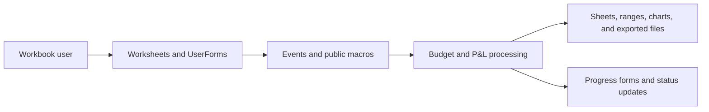

# Cyprus VBA Documentation

**Source workbook:** `Testing/Cyprus.xlsm`  
**Export folder:** `Budget/Cyprus/exported_vba`

This documentation is based on static analysis; the macros were not executed in Excel.
The exported `pnLSheet.bas` intentionally includes the approved dynamic-row and mapping-validation fixes described below.

## System Overview

The source project contains 53 VBA components: 7 standard modules, 41 workbook/worksheet class modules, and 5 UserForms. The manual-import export retains all 7 standard modules, the executable `ThisWorkbook` document module, and all 5 UserForms with their binary companions. The 40 empty worksheet modules are omitted. The final export contains 123 procedures and 162 detected direct internal calls.

## P&L Row Handling

- `GetLastUsedRow` determines worksheet boundaries dynamically instead of relying on fixed template rows.
- `GetLastDataRow` limits FY source arrays using their populated key column.
- `ValidatePnLTargetRows` verifies column AE mappings before any P&L values are cleared.
- `updatePnL` removes an active target-sheet filter before measuring and validating the complete P&L layout; the location sheet remains unfiltered after refresh.
- Inserted P&L rows are supported when the source AE formulas are recalculated and point to populated target rows.

## Main Call Flow

The diagram shows up to 100 direct calls detected statically. Dynamic calls and string-built procedure names may not appear.

## Component Inventory

| Component | Type | Procedures |
|---|---|---:|
| `addItems.frm` | UserForm | 9 |
| `CallOverall.bas` | Standard module | 1 |
| `checkbyDept.bas` | Standard module | 9 |
| `frmWait.frm` | UserForm | 1 |
| `Funcs.bas` | Standard module | 11 |
| `GlobalVariables.bas` | Standard module | 17 |
| `pnLSheet.bas` | Standard module | 38 |
| `Progress_Bar.frm` | UserForm | 6 |
| `progressCode.bas` | Standard module | 1 |
| `tableContents.frm` | UserForm | 9 |
| `ThisWorkbook.cls` | Workbook document module | 2 |
| `updateBudgetFY.bas` | Standard module | 10 |
| `viewPL.frm` | UserForm | 9 |

## Procedure Inventory

| Module | Procedure | Kind | Scope | Role |
|---|---|---|---|---|
| `addItems.frm` | `clearButton_Click` | Sub | Private | Event handler |
| `addItems.frm` | `updateButton_Click` | Sub | Private | Event handler |
| `addItems.frm` | `exitButton_Click` | Sub | Private | Event handler |
| `addItems.frm` | `TreeView1_BeforeLabelEdit` | Sub | Private | Event handler |
| `addItems.frm` | `Treeview1_NodeClick` | Sub | Private | Event handler |
| `addItems.frm` | `UserForm_Initialize` | Sub | Private | Event handler |
| `addItems.frm` | `FillChildNodes` | Sub | Public | Callable routine |
| `addItems.frm` | `FillSubChildNodes` | Sub | Public | Callable routine |
| `addItems.frm` | `ComboBox1_Change` | Sub | Private | Event handler |
| `CallOverall.bas` | `OverAllPnl` | Sub | Public | Callable routine |
| `checkbyDept.bas` | `getActualFYSummaryDict` | Function | Public | Callable routine |
| `checkbyDept.bas` | `getActualFYFiveYearMappingDict` | Function | Public | Callable routine |
| `checkbyDept.bas` | `populateSetupActualTotals` | Sub | Public | Callable routine |
| `checkbyDept.bas` | `getBudgetFYSummaryDict` | Function | Public | Callable routine |
| `checkbyDept.bas` | `getBudgetFYFiveYearMappingDict` | Function | Public | Callable routine |
| `checkbyDept.bas` | `populateSetupBudgetTotals` | Sub | Public | Callable routine |
| `checkbyDept.bas` | `populateWSActualTotals` | Sub | Public | Callable routine |
| `checkbyDept.bas` | `populateWSBudgetTotals` | Sub | Public | Callable routine |
| `checkbyDept.bas` | `UpdateKPI` | Sub | Public | Callable routine |
| `frmWait.frm` | `UserForm_Initialize` | Sub | Private | Event handler |
| `Funcs.bas` | `ForceFullCalculation` | Sub | Public | Callable routine |
| `Funcs.bas` | `SetUpDataValidation` | Sub | Public | Callable routine |
| `Funcs.bas` | `FilterActualFY` | Sub | Public | Callable routine |
| `Funcs.bas` | `AddXMLReference` | Sub | Public | Callable routine |
| `Funcs.bas` | `choosePL` | Sub | Public | Callable routine |
| `Funcs.bas` | `openTOC` | Sub | Public | Callable routine |
| `Funcs.bas` | `addItemsForm` | Sub | Public | Callable routine |
| `Funcs.bas` | `SetGlobalFYSheetValues` | Sub | Public | Callable routine |
| `Funcs.bas` | `groupData` | Sub | Public | Callable routine |
| `Funcs.bas` | `groupActual` | Sub | Public | Callable routine |
| `Funcs.bas` | `groupBudgetFY` | Sub | Public | Callable routine |
| `GlobalVariables.bas` | `declareGlobal` | Sub | Public | Callable routine |
| `GlobalVariables.bas` | `manualCategoriesItems` | Sub | Public | Callable routine |
| `GlobalVariables.bas` | `newRows` | Sub | Public | Callable routine |
| `GlobalVariables.bas` | `ProcessGlobalSheetCell` | Sub | Private | Callable routine |
| `GlobalVariables.bas` | `ProcessAdjustmentTransaction` | Sub | Private | Callable routine |
| `GlobalVariables.bas` | `UpdateDictionaryValue` | Sub | Private | Callable routine |
| `GlobalVariables.bas` | `WriteBulkBudgetData` | Sub | Private | Callable routine |
| `GlobalVariables.bas` | `clearBudget` | Sub | Public | Callable routine |
| `GlobalVariables.bas` | `UpdateBudgetFYWithAllocations` | Sub | Public | Callable routine |
| `GlobalVariables.bas` | `UpdateBudgetFYWithAllocationsNoDept` | Sub | Public | Callable routine |
| `GlobalVariables.bas` | `newRowsActual` | Sub | Public | Callable routine |
| `GlobalVariables.bas` | `ProcessActualSheetCell` | Sub | Private | Callable routine |
| `GlobalVariables.bas` | `ProcessActualAdjustmentTransaction` | Sub | Private | Callable routine |
| `GlobalVariables.bas` | `UpdateActualDictionaryValue` | Sub | Private | Callable routine |
| `GlobalVariables.bas` | `WriteBulkActualData` | Sub | Private | Callable routine |
| `GlobalVariables.bas` | `UpdateActualFYWithAllocations` | Sub | Public | Callable routine |
| `GlobalVariables.bas` | `UpdateActualFYWithAllocationsNoDept` | Sub | Public | Callable routine |
| `pnLSheet.bas` | `GetLastUsedRow` | Function | Private | Dynamic worksheet boundary helper |
| `pnLSheet.bas` | `GetLastDataRow` | Function | Private | Dynamic FY data boundary helper |
| `pnLSheet.bas` | `ValidatePnLTargetRows` | Function | Private | Pre-clear FY-to-P&L mapping validation |
| `pnLSheet.bas` | `ClearPNL` | Sub | Public | Callable routine |
| `pnLSheet.bas` | `ClearDeptPNL` | Sub | Public | Callable routine |
| `pnLSheet.bas` | `updatePnL` | Sub | Public | Callable routine |
| `pnLSheet.bas` | `BulkWriteGtoR` | Sub | Private | Callable routine |
| `pnLSheet.bas` | `BulkWriteWtoAH` | Sub | Private | Callable routine |
| `pnLSheet.bas` | `BulkWriteAVtoBH` | Sub | Private | Callable routine |
| `pnLSheet.bas` | `exportPnLs` | Sub | Public | Callable routine |
| `pnLSheet.bas` | `CleanFilenames` | Function | Private | Callable routine |
| `pnLSheet.bas` | `CleanSheetName` | Function | Private | Callable routine |
| `pnLSheet.bas` | `CopySheetStructureFast` | Function | Private | Callable routine |
| `pnLSheet.bas` | `BulkBreakLinksAllSheets` | Sub | Private | Callable routine |
| `pnLSheet.bas` | `BulkRemoveControlsAllSheets` | Sub | Private | Callable routine |
| `pnLSheet.bas` | `BuildMasterDictionary` | Function | Private | Callable routine |
| `pnLSheet.bas` | `UpdatePnLForExportedSheets` | Sub | Private | Callable routine |
| `pnLSheet.bas` | `BulkWriteToSheet` | Sub | Private | Callable routine |
| `pnLSheet.bas` | `updatePnLbyDept` | Sub | Public | Callable routine |
| `pnLSheet.bas` | `BulkWriteGtoRbyDept` | Sub | Private | Callable routine |
| `pnLSheet.bas` | `ApplyFormulaRange` | Sub | Private | Callable routine |
| `pnLSheet.bas` | `FindRowByText` | Function | Private | Callable routine |
| `pnLSheet.bas` | `ReadSpecialRowsConfig` | Function | Private | Callable routine |
| `pnLSheet.bas` | `AddCriteriaIfExists` | Sub | Private | Callable routine |
| `pnLSheet.bas` | `EvaluateCriteria` | Function | Private | Callable routine |
| `pnLSheet.bas` | `EvaluateSingleCriteria` | Function | Private | Callable routine |
| `pnLSheet.bas` | `ProcessSpecialWinRows` | Sub | Private | Callable routine |
| `pnLSheet.bas` | `ProcessDynamicWinRow` | Sub | Private | Callable routine |
| `pnLSheet.bas` | `ProcessDynamicWinRowMultiple` | Sub | Private | Callable routine |
| `pnLSheet.bas` | `EvaluateRowCriteria` | Function | Private | Callable routine |
| `pnLSheet.bas` | `ProcessSpecialWinRowsByDept` | Sub | Private | Callable routine |
| `pnLSheet.bas` | `ProcessDynamicWinRowByDept` | Sub | Private | Callable routine |
| `pnLSheet.bas` | `ProcessDynamicWinRowByDeptMultiple` | Sub | Private | Callable routine |
| `pnLSheet.bas` | `EvaluateRowCriteriaForDept` | Function | Private | Callable routine |
| `pnLSheet.bas` | `updateManual` | Sub | Public | Callable routine |
| `pnLSheet.bas` | `UpdateBudgetRowsWithAllocation` | Sub | Private | Callable routine |
| `pnLSheet.bas` | `CreateNewBudgetRow` | Sub | Private | Callable routine |
| `pnLSheet.bas` | `WriteBulkBudgetDataManual` | Sub | Private | Callable routine |
| `Progress_Bar.frm` | `ProgressContainer_Click` | Sub | Private | Event handler |
| `Progress_Bar.frm` | `StatusText_Click` | Sub | Private | Event handler |
| `Progress_Bar.frm` | `UserForm_Initialize` | Sub | Private | Event handler |
| `Progress_Bar.frm` | `setStatusText` | Sub | Public | Callable routine |
| `Progress_Bar.frm` | `percentDone` | Sub | Public | Callable routine |
| `Progress_Bar.frm` | `UserForm_QueryClose` | Sub | Private | Event handler |
| `progressCode.bas` | `showProgress` | Sub | Public | Callable routine |
| `tableContents.frm` | `Label11_Click` | Sub | Private | Event handler |
| `tableContents.frm` | `Label12_Click` | Sub | Private | Event handler |
| `tableContents.frm` | `updateButton_Click` | Sub | Private | Event handler |
| `tableContents.frm` | `exitButton_Click` | Sub | Private | Event handler |
| `tableContents.frm` | `TreeView1_BeforeLabelEdit` | Sub | Private | Event handler |
| `tableContents.frm` | `Treeview1_NodeClick` | Sub | Private | Event handler |
| `tableContents.frm` | `UserForm_Initialize` | Sub | Private | Event handler |
| `tableContents.frm` | `FillChildNodes` | Sub | Public | Callable routine |
| `tableContents.frm` | `FillSubChildNodes` | Sub | Public | Callable routine |
| `ThisWorkbook.cls` | `Workbook_Open` | Sub | Private | Workbook event handler |
| `ThisWorkbook.cls` | `RegisterOCX` | Sub | Public | Callable routine |
| `updateBudgetFY.bas` | `updateAssumptionsExcel` | Sub | Public | Callable routine |
| `updateBudgetFY.bas` | `updateAssumptionsForecastExcel` | Sub | Public | Callable routine |
| `updateBudgetFY.bas` | `updateCompAssumptions` | Sub | Public | Callable routine |
| `updateBudgetFY.bas` | `updateCompForecastAssumptions` | Sub | Public | Callable routine |
| `updateBudgetFY.bas` | `updatePayrollAssumptions` | Sub | Public | Callable routine |
| `updateBudgetFY.bas` | `updatePayrollForecastAssumptions` | Sub | Public | Callable routine |
| `updateBudgetFY.bas` | `updateOpexAssumptions` | Sub | Public | Callable routine |
| `updateBudgetFY.bas` | `updateOpexForecastAssumptions` | Sub | Public | Callable routine |
| `updateBudgetFY.bas` | `updateBelowAssumptions` | Sub | Public | Callable routine |
| `updateBudgetFY.bas` | `updateBelowForecastAssumptions` | Sub | Public | Callable routine |
| `viewPL.frm` | `updateButton_Click` | Sub | Private | Event handler |
| `viewPL.frm` | `exitButton_Click` | Sub | Private | Event handler |
| `viewPL.frm` | `TreeView1_BeforeLabelEdit` | Sub | Private | Event handler |
| `viewPL.frm` | `Treeview1_NodeClick` | Sub | Private | Event handler |
| `viewPL.frm` | `UserForm_Initialize` | Sub | Private | Event handler |
| `viewPL.frm` | `FillChildNodes` | Sub | Public | Callable routine |
| `viewPL.frm` | `FillSubChildNodes` | Sub | Public | Callable routine |
| `viewPL.frm` | `FillSubSubChildNodes` | Sub | Public | Callable routine |
| `viewPL.frm` | `FillSubSubSubChildNodes` | Sub | Public | Callable routine |

## Direct Call Relationships

| Caller | Callee |
|---|---|
| `CallOverall.bas.OverAllPnl` | `updatePnL` |
| `Funcs.bas.SetGlobalFYSheetValues` | `declareGlobal` |
| `Funcs.bas.groupActual` | `declareGlobal` |
| `Funcs.bas.groupActual` | `groupData` |
| `Funcs.bas.groupBudgetFY` | `declareGlobal` |
| `Funcs.bas.groupBudgetFY` | `groupData` |
| `Funcs.bas.groupData` | `declareGlobal` |
| `GlobalVariables.bas.ProcessActualSheetCell` | `UpdateActualDictionaryValue` |
| `GlobalVariables.bas.ProcessGlobalSheetCell` | `UpdateDictionaryValue` |
| `GlobalVariables.bas.UpdateActualFYWithAllocations` | `SetGlobalFYSheetValues` |
| `GlobalVariables.bas.UpdateActualFYWithAllocations` | `declareGlobal` |
| `GlobalVariables.bas.UpdateActualFYWithAllocations` | `percentDone` |
| `GlobalVariables.bas.UpdateActualFYWithAllocations` | `setStatusText` |
| `GlobalVariables.bas.UpdateActualFYWithAllocationsNoDept` | `SetGlobalFYSheetValues` |
| `GlobalVariables.bas.UpdateActualFYWithAllocationsNoDept` | `declareGlobal` |
| `GlobalVariables.bas.UpdateActualFYWithAllocationsNoDept` | `percentDone` |
| `GlobalVariables.bas.UpdateActualFYWithAllocationsNoDept` | `setStatusText` |
| `GlobalVariables.bas.UpdateBudgetFYWithAllocations` | `SetGlobalFYSheetValues` |
| `GlobalVariables.bas.UpdateBudgetFYWithAllocations` | `declareGlobal` |
| `GlobalVariables.bas.UpdateBudgetFYWithAllocations` | `percentDone` |
| `GlobalVariables.bas.UpdateBudgetFYWithAllocations` | `setStatusText` |
| `GlobalVariables.bas.UpdateBudgetFYWithAllocationsNoDept` | `SetGlobalFYSheetValues` |
| `GlobalVariables.bas.UpdateBudgetFYWithAllocationsNoDept` | `declareGlobal` |
| `GlobalVariables.bas.UpdateBudgetFYWithAllocationsNoDept` | `percentDone` |
| `GlobalVariables.bas.UpdateBudgetFYWithAllocationsNoDept` | `setStatusText` |
| `GlobalVariables.bas.newRows` | `ProcessAdjustmentTransaction` |
| `GlobalVariables.bas.newRows` | `ProcessGlobalSheetCell` |
| `GlobalVariables.bas.newRows` | `SetGlobalFYSheetValues` |
| `GlobalVariables.bas.newRows` | `WriteBulkBudgetData` |
| `GlobalVariables.bas.newRows` | `declareGlobal` |
| `GlobalVariables.bas.newRows` | `percentDone` |
| `GlobalVariables.bas.newRows` | `setStatusText` |
| `GlobalVariables.bas.newRowsActual` | `ProcessActualAdjustmentTransaction` |
| `GlobalVariables.bas.newRowsActual` | `ProcessActualSheetCell` |
| `GlobalVariables.bas.newRowsActual` | `SetGlobalFYSheetValues` |
| `GlobalVariables.bas.newRowsActual` | `WriteBulkActualData` |
| `GlobalVariables.bas.newRowsActual` | `declareGlobal` |
| `GlobalVariables.bas.newRowsActual` | `percentDone` |
| `GlobalVariables.bas.newRowsActual` | `setStatusText` |
| `ThisWorkbook.cls.Workbook_Open` | `RegisterOCX` |
| `addItems.frm.FillChildNodes` | `FillSubChildNodes` |
| `addItems.frm.Treeview1_NodeClick` | `declareGlobal` |
| `addItems.frm.UserForm_Initialize` | `FillChildNodes` |
| `addItems.frm.updateButton_Click` | `declareGlobal` |
| `checkbyDept.bas.UpdateKPI` | `populateWSActualTotals` |
| `checkbyDept.bas.UpdateKPI` | `populateWSBudgetTotals` |
| `checkbyDept.bas.getActualFYFiveYearMappingDict` | `declareGlobal` |
| `checkbyDept.bas.getActualFYSummaryDict` | `declareGlobal` |
| `checkbyDept.bas.getBudgetFYFiveYearMappingDict` | `declareGlobal` |
| `checkbyDept.bas.getBudgetFYSummaryDict` | `declareGlobal` |
| `checkbyDept.bas.populateSetupActualTotals` | `declareGlobal` |
| `checkbyDept.bas.populateSetupActualTotals` | `getActualFYFiveYearMappingDict` |
| `checkbyDept.bas.populateSetupActualTotals` | `getActualFYSummaryDict` |
| `checkbyDept.bas.populateSetupActualTotals` | `percentDone` |
| `checkbyDept.bas.populateSetupActualTotals` | `setStatusText` |
| `checkbyDept.bas.populateSetupBudgetTotals` | `declareGlobal` |
| `checkbyDept.bas.populateSetupBudgetTotals` | `getBudgetFYFiveYearMappingDict` |
| `checkbyDept.bas.populateSetupBudgetTotals` | `getBudgetFYSummaryDict` |
| `checkbyDept.bas.populateSetupBudgetTotals` | `percentDone` |
| `checkbyDept.bas.populateSetupBudgetTotals` | `setStatusText` |
| `checkbyDept.bas.populateWSActualTotals` | `declareGlobal` |
| `checkbyDept.bas.populateWSActualTotals` | `getActualFYFiveYearMappingDict` |
| `checkbyDept.bas.populateWSActualTotals` | `getActualFYSummaryDict` |
| `checkbyDept.bas.populateWSActualTotals` | `percentDone` |
| `checkbyDept.bas.populateWSActualTotals` | `setStatusText` |
| `checkbyDept.bas.populateWSBudgetTotals` | `declareGlobal` |
| `checkbyDept.bas.populateWSBudgetTotals` | `getBudgetFYFiveYearMappingDict` |
| `checkbyDept.bas.populateWSBudgetTotals` | `getBudgetFYSummaryDict` |
| `checkbyDept.bas.populateWSBudgetTotals` | `percentDone` |
| `checkbyDept.bas.populateWSBudgetTotals` | `setStatusText` |
| `pnLSheet.bas.BuildMasterDictionary` | `GetLastDataRow` |
| `pnLSheet.bas.BuildMasterDictionary` | `GetLastUsedRow` |
| `pnLSheet.bas.BuildMasterDictionary` | `ValidatePnLTargetRows` |
| `pnLSheet.bas.BulkWriteGtoRbyDept` | `ApplyFormulaRange` |
| `pnLSheet.bas.ClearDeptPNL` | `GetLastUsedRow` |
| `pnLSheet.bas.ClearPNL` | `GetLastUsedRow` |
| `pnLSheet.bas.CopySheetStructureFast` | `CleanSheetName` |
| `pnLSheet.bas.EvaluateCriteria` | `EvaluateSingleCriteria` |
| `pnLSheet.bas.EvaluateRowCriteria` | `EvaluateCriteria` |
| `pnLSheet.bas.EvaluateRowCriteriaForDept` | `EvaluateCriteria` |
| `pnLSheet.bas.FindRowByText` | `GetLastUsedRow` |
| `pnLSheet.bas.ProcessDynamicWinRow` | `EvaluateRowCriteria` |
| `pnLSheet.bas.ProcessDynamicWinRowByDept` | `EvaluateRowCriteriaForDept` |
| `pnLSheet.bas.ProcessDynamicWinRowByDeptMultiple` | `EvaluateRowCriteriaForDept` |
| `pnLSheet.bas.ProcessDynamicWinRowMultiple` | `EvaluateRowCriteria` |
| `pnLSheet.bas.ProcessSpecialWinRows` | `FindRowByText` |
| `pnLSheet.bas.ProcessSpecialWinRows` | `ProcessDynamicWinRowMultiple` |
| `pnLSheet.bas.ProcessSpecialWinRows` | `ReadSpecialRowsConfig` |
| `pnLSheet.bas.ProcessSpecialWinRowsByDept` | `FindRowByText` |
| `pnLSheet.bas.ProcessSpecialWinRowsByDept` | `ProcessDynamicWinRowByDeptMultiple` |
| `pnLSheet.bas.ProcessSpecialWinRowsByDept` | `ReadSpecialRowsConfig` |
| `pnLSheet.bas.ReadSpecialRowsConfig` | `AddCriteriaIfExists` |
| `pnLSheet.bas.UpdateBudgetRowsWithAllocation` | `CreateNewBudgetRow` |
| `pnLSheet.bas.UpdatePnLForExportedSheets` | `BulkWriteToSheet` |
| `pnLSheet.bas.UpdatePnLForExportedSheets` | `GetLastDataRow` |
| `pnLSheet.bas.UpdatePnLForExportedSheets` | `GetLastUsedRow` |
| `pnLSheet.bas.UpdatePnLForExportedSheets` | `ProcessSpecialWinRows` |
| `pnLSheet.bas.exportPnLs` | `BuildMasterDictionary` |
| `pnLSheet.bas.exportPnLs` | `BulkBreakLinksAllSheets` |
| `pnLSheet.bas.exportPnLs` | `BulkRemoveControlsAllSheets` |
| `pnLSheet.bas.exportPnLs` | `CleanFilenames` |
| `pnLSheet.bas.exportPnLs` | `ClearPNL` |
| `pnLSheet.bas.exportPnLs` | `CopySheetStructureFast` |
| `pnLSheet.bas.exportPnLs` | `UpdatePnLForExportedSheets` |
| `pnLSheet.bas.exportPnLs` | `declareGlobal` |
| `pnLSheet.bas.updateManual` | `GetLastUsedRow` |
| `pnLSheet.bas.updateManual` | `UpdateBudgetRowsWithAllocation` |
| `pnLSheet.bas.updateManual` | `WriteBulkBudgetDataManual` |
| `pnLSheet.bas.updateManual` | `declareGlobal` |
| `pnLSheet.bas.updateManual` | `updatePnL` |
| `pnLSheet.bas.updatePnL` | `BulkWriteAVtoBH` |
| `pnLSheet.bas.updatePnL` | `BulkWriteGtoR` |
| `pnLSheet.bas.updatePnL` | `BulkWriteWtoAH` |
| `pnLSheet.bas.updatePnL` | `ClearPNL` |
| `pnLSheet.bas.updatePnL` | `GetLastDataRow` |
| `pnLSheet.bas.updatePnL` | `GetLastUsedRow` |
| `pnLSheet.bas.updatePnL` | `ProcessSpecialWinRows` |
| `pnLSheet.bas.updatePnL` | `ValidatePnLTargetRows` |
| `pnLSheet.bas.updatePnL` | `declareGlobal` |
| `pnLSheet.bas.updatePnLbyDept` | `BulkWriteGtoRbyDept` |
| `pnLSheet.bas.updatePnLbyDept` | `ClearDeptPNL` |
| `pnLSheet.bas.updatePnLbyDept` | `GetLastDataRow` |
| `pnLSheet.bas.updatePnLbyDept` | `GetLastUsedRow` |
| `pnLSheet.bas.updatePnLbyDept` | `ProcessSpecialWinRowsByDept` |
| `pnLSheet.bas.updatePnLbyDept` | `ValidatePnLTargetRows` |
| `pnLSheet.bas.updatePnLbyDept` | `declareGlobal` |
| `progressCode.bas.showProgress` | `percentDone` |
| `progressCode.bas.showProgress` | `setStatusText` |
| `tableContents.frm.Treeview1_NodeClick` | `declareGlobal` |
| `tableContents.frm.UserForm_Initialize` | `FillChildNodes` |
| `tableContents.frm.updateButton_Click` | `declareGlobal` |
| `updateBudgetFY.bas.updateAssumptionsExcel` | `declareGlobal` |
| `updateBudgetFY.bas.updateAssumptionsExcel` | `newRows` |
| `updateBudgetFY.bas.updateAssumptionsForecastExcel` | `declareGlobal` |
| `updateBudgetFY.bas.updateAssumptionsForecastExcel` | `newRowsActual` |
| `updateBudgetFY.bas.updateBelowAssumptions` | `UpdateBudgetFYWithAllocationsNoDept` |
| `updateBudgetFY.bas.updateBelowAssumptions` | `declareGlobal` |
| `updateBudgetFY.bas.updateBelowForecastAssumptions` | `UpdateActualFYWithAllocationsNoDept` |
| `updateBudgetFY.bas.updateBelowForecastAssumptions` | `declareGlobal` |
| `updateBudgetFY.bas.updateBelowForecastAssumptions` | `newRowsActual` |
| `updateBudgetFY.bas.updateCompAssumptions` | `UpdateBudgetFYWithAllocations` |
| `updateBudgetFY.bas.updateCompAssumptions` | `declareGlobal` |
| `updateBudgetFY.bas.updateCompForecastAssumptions` | `UpdateActualFYWithAllocations` |
| `updateBudgetFY.bas.updateCompForecastAssumptions` | `declareGlobal` |
| `updateBudgetFY.bas.updateCompForecastAssumptions` | `newRowsActual` |
| `updateBudgetFY.bas.updateOpexAssumptions` | `UpdateBudgetFYWithAllocationsNoDept` |
| `updateBudgetFY.bas.updateOpexAssumptions` | `declareGlobal` |
| `updateBudgetFY.bas.updateOpexForecastAssumptions` | `UpdateActualFYWithAllocationsNoDept` |
| `updateBudgetFY.bas.updateOpexForecastAssumptions` | `declareGlobal` |
| `updateBudgetFY.bas.updateOpexForecastAssumptions` | `newRowsActual` |
| `updateBudgetFY.bas.updatePayrollAssumptions` | `UpdateBudgetFYWithAllocationsNoDept` |
| `updateBudgetFY.bas.updatePayrollAssumptions` | `declareGlobal` |
| `updateBudgetFY.bas.updatePayrollForecastAssumptions` | `UpdateActualFYWithAllocationsNoDept` |
| `updateBudgetFY.bas.updatePayrollForecastAssumptions` | `declareGlobal` |
| `updateBudgetFY.bas.updatePayrollForecastAssumptions` | `newRowsActual` |
| `viewPL.frm.FillChildNodes` | `FillSubChildNodes` |
| `viewPL.frm.FillSubChildNodes` | `FillSubSubChildNodes` |
| `viewPL.frm.FillSubSubChildNodes` | `FillSubSubSubChildNodes` |
| `viewPL.frm.Treeview1_NodeClick` | `declareGlobal` |
| `viewPL.frm.UserForm_Initialize` | `FillChildNodes` |
| `viewPL.frm.updateButton_Click` | `declareGlobal` |
| `viewPL.frm.updateButton_Click` | `updatePnL` |

## Worksheet References

These are literal worksheet names detected in the exported source. Dynamic sheet names and active-sheet operations are documented only in code.

| Worksheet | Referenced by |
|---|---|
| `(A) Averages` | `GlobalVariables.bas` |
| `(A) Below EBITDA` | `GlobalVariables.bas` |
| `(A) Comps` | `GlobalVariables.bas` |
| `(A) F&B` | `GlobalVariables.bas` |
| `(A) Hotels` | `GlobalVariables.bas` |
| `(A) Mass` | `GlobalVariables.bas` |
| `(A) Opex` | `Funcs.bas`, `GlobalVariables.bas` |
| `(A) Others` | `GlobalVariables.bas` |
| `(A) Payroll` | `GlobalVariables.bas` |
| `(A) Slots` | `GlobalVariables.bas` |
| `(A) VIP` | `GlobalVariables.bas` |
| `Actual-FY` | `Funcs.bas`, `GlobalVariables.bas` |
| `addItems` | `addItems.frm` |
| `addItems-Category1` | `addItems.frm` |
| `addItems-Child` | `addItems.frm` |
| `addItems-Parameters` | `addItems.frm` |
| `Budget-FY` | `GlobalVariables.bas` |
| `Exclusions` | `GlobalVariables.bas` |
| `Forecast` | `GlobalVariables.bas` |
| `P&L` | `GlobalVariables.bas` |
| `P&L (USD)` | `GlobalVariables.bas` |
| `P&L by Dept` | `GlobalVariables.bas`, `pnLSheet.bas` |
| `P&L-Category1` | `viewPL.frm` |
| `P&L-Child` | `tableContents.frm`, `viewPL.frm` |
| `P&L-Child-Child` | `viewPL.frm` |
| `P&L-Child-Child-Child` | `viewPL.frm` |
| `P&L-Parameters` | `viewPL.frm` |
| `Parent P&Ls` | `GlobalVariables.bas` |
| `Setup` | `GlobalVariables.bas` |
| `Sheet1` | `Funcs.bas`, `pnLSheet.bas` |
| `TOC` | `tableContents.frm` |
| `TOC-Parameters` | `tableContents.frm` |

## UserForms

### `tableContents`

Code: `exported_vba/tableContents.frm`  
Binary designer: `exported_vba/tableContents.frx`

| Control | Caption | Type ID / class |
|---|---|---:|
| `exitButton` |  | 17 |
| `updateButton` |  | 17 |
| `Label11` | Description: | 21 |
| `Label12` | Table of Contents | 21 |
| `Label13` |  | 21 |
| `TreeView1` |  | `MSComctlLib.TreeView` |

Event and helper procedures: `Label11_Click`, `Label12_Click`, `updateButton_Click`, `exitButton_Click`, `TreeView1_BeforeLabelEdit`, `Treeview1_NodeClick`, `UserForm_Initialize`, `FillChildNodes`, `FillSubChildNodes`

### `addItems`

Code: `exported_vba/addItems.frm`  
Binary designer: `exported_vba/addItems.frx`

| Control | Caption | Type ID / class |
|---|---|---:|
| `exitButton` |  | 17 |
| `Label1` | Cost Center | 21 |
| `Label2` | Customer Segment | 21 |
| `Label3` | Venue | 21 |
| `updateButton` |  | 17 |
| `Label11` | Company | 21 |
| `TextBox2` |  | 23 |
| `TextBox3` |  | 23 |
| `TextBox4` |  | 23 |
| `TextBox5` |  | 23 |
| `Label12` | Select Department: | 21 |
| `ComboBox1` |  | 25 |
| `Label13` | Select Ledger Account | 21 |
| `Label14` | Revenue Category | 21 |
| `ComboBox2` |  | 25 |
| `Label15` | Spend Category | 21 |
| `ComboBox3` |  | 25 |
| `Label16` | Type Row Number | 21 |
| `TextBox6` |  | 23 |
| `clearButton` |  | 17 |
| `TreeView1` |  | `MSComctlLib.TreeView` |

Event and helper procedures: `clearButton_Click`, `updateButton_Click`, `exitButton_Click`, `TreeView1_BeforeLabelEdit`, `Treeview1_NodeClick`, `UserForm_Initialize`, `FillChildNodes`, `FillSubChildNodes`, `ComboBox1_Change`

### `Progress_Bar`

Code: `exported_vba/Progress_Bar.frm`  
Binary designer: `exported_vba/Progress_Bar.frx`

| Control | Caption | Type ID / class |
|---|---|---:|
| `ProgressContainer` |  | 21 |
| `ProgressBar` |  | 21 |
| `StatusText` | Status | 21 |

Event and helper procedures: `ProgressContainer_Click`, `StatusText_Click`, `UserForm_Initialize`, `setStatusText`, `percentDone`, `UserForm_QueryClose`

### `frmWait`

Code: `exported_vba/frmWait.frm`  
Binary designer: `exported_vba/frmWait.frx`

| Control | Caption | Type ID / class |
|---|---|---:|
| `StatusText` | Updating Forecast... | 21 |

Event and helper procedures: `UserForm_Initialize`

### `viewPL`

Code: `exported_vba/viewPL.frm`  
Binary designer: `exported_vba/viewPL.frx`

| Control | Caption | Type ID / class |
|---|---|---:|
| `exitButton` |  | 17 |
| `Label1` | Cost Center | 21 |
| `Label2` | Customer Segment | 21 |
| `Label3` | Venue | 21 |
| `updateButton` |  | 17 |
| `Label11` | Company | 21 |
| `TextBox2` |  | 23 |
| `TextBox3` |  | 23 |
| `TextBox4` |  | 23 |
| `TextBox5` |  | 23 |
| `Label12` | Select P&L: | 21 |
| `TextBox1` |  | 23 |
| `TextBox6` |  | 23 |
| `TreeView1` |  | `MSComctlLib.TreeView` |

Event and helper procedures: `updateButton_Click`, `exitButton_Click`, `TreeView1_BeforeLabelEdit`, `Treeview1_NodeClick`, `UserForm_Initialize`, `FillChildNodes`, `FillSubChildNodes`, `FillSubSubChildNodes`, `FillSubSubSubChildNodes`

## VBA References

| Reference | Requirement |
|---|---|
| `stdole` | OLE Automation |
| `Office` | Microsoft Office 16.0 Object Library |
| `MSForms` | Microsoft Forms 2.0 Object Library |
| `MSXML2` | Microsoft XML, v6.0 |
| `MSComctlLib` | Microsoft Windows Common Controls 6.0 (SP6) |

## Export Notes

- Import each `.bas` module separately through the VBA editor or the Budget importer.
- Keep every `.frm` beside its same-name `.frx`; import the `.frm`, not the `.frx`.
- Copy `ThisWorkbook.cls` code into the destination workbook’s existing `ThisWorkbook` object; do not import it as an ordinary class.
- The 40 empty worksheet class modules are intentionally omitted.
- The FRX files contain native 24-byte `OleObjectBlob` wrappers and workbook-specific designer streams.
- Microsoft Forms 2.0, Microsoft XML 6.0, and Microsoft Windows Common Controls 6.0 (`MSCOMCTL.OCX`) are required.
- The [VBA import and export guide](../VBA_IMPORT_EXPORT.md) documents automated and manual import procedures.
- The Testing workbook remains unchanged; only the exported `pnLSheet.bas` contains the approved P&L hardening beyond source extraction.
