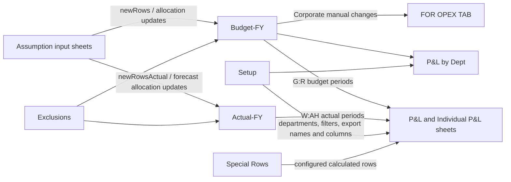
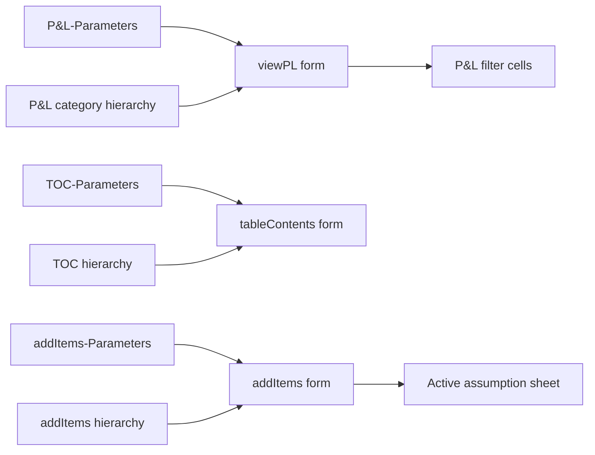

# Budget worksheet schema

This document describes the worksheet contracts visible in the exported VBA for the Corporate and Manila budget workbooks. It is a static analysis of `Budget/Corporate/exported_vba` and `Budget/Manila/exported_vba`; the macros were not executed in Excel and the source workbooks are not present in this repository.

## How to read this schema

| Mark | Meaning |
|---|---|
| R | Reads values, formulas, headers, or worksheet state |
| W | Writes values or formulas |
| C | Clears values or filters |
| F | Formats, filters, groups, protects, hides, or changes controls/charts |
| X | Copies, creates, deletes, or exports a worksheet |
| B | Binds a worksheet to a global variable; the procedure fails if the tab is missing |
| Calc | Recalculates the worksheet |

`last` means a last-used row calculated at runtime. “Both” means the same contract exists in Corporate and Manila unless a difference is called out. A worksheet parameter or `ActiveSheet` is documented as a dynamic sheet family rather than assigned an invented tab name.

## System data flow

## Fixed worksheet inventory

### Core data and configuration

| Worksheet | Variant | Access | VBA-observable contract | Main procedures |
|---|---|---:|---|---|
| `Setup` | Both | B/R/W/F | `B309` is read as a database path even though `globalDbPath` is commented as a declaration. Department/export metadata is read from row 9 onward, principally `B`, `D:H`, and Corporate-configurable filename, column-reference, subfolder, and alternate-name columns (defaults include `Q:R`). Actual totals are written under headers in Corporate `BG:BK` and Manila `AT:BD`; budget totals use Corporate `AM:AQ` and Manila `Z:AI`. Exported copies are collapsed and activated. | `declareGlobal`; `populateSetupActualTotals`; `populateSetupBudgetTotals`; `exportPnLs`; `CopySheetStructureFast`; Corporate `collapseSetupSheet` |
| `Budget-FY` | Both | B/R/W/C/F/Calc/X | Primary budget store. Detail begins at row 12. `A` is a concatenated key; `B:I` are dimensions; `J:U` are 12 periods; `V` is a lookup/YTD basis; `W:Y` are mappings including department in `Y`; `Z:AJ` contain derived values/formulas. Bulk processes read/write through `AJ` (Corporate manual processing also flags updated rows in `AK`). Grouping can clear through `AR`; `clearBudget` clears `A12:AT10000`. Corporate exports filter/copy `A12:AN[last]`. | `newRows`; allocation procedures; `groupBudgetFY`; `SetGlobalFYSheetValues`; P&L update procedures; manual-change procedures; Corporate export helpers |
| `Actual-FY` | Both | B/R/W/C/F/Calc/X | Actual/forecast store with the same row-12 dimensional and period layout used by `Budget-FY`. VBA reads/writes `A:U`, restores formulas in `V:AJ`, filters field 23 (`W`), and hard-codes `W:Y` and `AB:AJ`. P&L logic reads `A12:AJ[last]`. Corporate exports filter/copy `A12:AN[last]`. | `newRowsActual`; actual allocation procedures; `FilterActualFY`; `groupActual`; `SetGlobalFYSheetValues`; P&L update procedures; Corporate export helpers |
| `Exclusions` | Both | R/Calc | Rows are scanned from row 2 to the last nonblank in `A`. `A` holds the transaction/allocation type; columns `B:I` are optional dimension predicates. Matching rows suppress additions or allocation updates in the FY sheets. | `UpdateBudgetFYWithAllocations`; `UpdateBudgetFYWithAllocationsNoDept`; `UpdateActualFYWithAllocations`; `UpdateActualFYWithAllocationsNoDept` |
| `Special Rows` | Both | R | Located by iterating every worksheet and comparing `ws.Name`, not by a direct `Sheets(...)` call. Row 1 supplies configuration headers; rows 2 through the last used row define target P&L text, criteria, include operators, and inversion. It drives special win/summary rows in P&L outputs. | `ReadSpecialRowsConfig`; `AddCriteriaIfExists`; `ProcessSpecialWinRows`; `ProcessSpecialWinRowsByDept` |
| `Forecast` | Corporate only | B | Actively bound to `globalForecastSheet` by Corporate `declareGlobal`, but no other exported procedure reads or writes it. The equivalent Manila binding is commented out. | `declareGlobal` |

### P&L outputs and selector data

| Worksheet | Variant | Access | VBA-observable contract | Main procedures |
|---|---|---:|---|---|
| `P&L` | Both | B/R/W/C/Calc/X | Master P&L template and normal interactive target. Selector cells are `G1:G4` (company, cost center, customer segment, venue), `I1` (department/group), `I2` (date/filter), and `A2` (update mode). Detail starts at row 8: budget values are written to `G:R`, actual values to `W:AH`, and an additional block to `AV:BG`; supporting ranges in `V` and `AV:BG` are cleared through the actual last used row. Column `AO` (41) carries the `Do not clear` marker. Manual changes are read from `A8:AM[last]`. It is copied as the template for exported department sheets. | `viewPL.updateButton_Click`; `ClearPNL`; `updatePnL`; bulk writers; `updateManual`; `exportPnLs`; `CopySheetStructureFast` |
| `P&L (USD)` | Both | B/Calc | Recalculated after `viewPL` changes the master P&L selectors. No direct value writes appear in the exported VBA. | `declareGlobal`; `viewPL.updateButton_Click` |
| `P&L by Dept` | Both | B/R/W/C/Calc | Department matrix. Row 6 marks formula columns and row 7 contains department headers. The implementation clears/writes the dynamic department matrix, preserves configured formulas, and uses `I2` (falling back to `P&L!I2`) as the date filter. | `ClearDeptPNL`; `updatePnLbyDept`; `BulkWriteGtoRbyDept`; `ApplyFormulaRange` |
| `P&L-Parameters` | Both | R; Corporate export F/X | Column `A`, rows `2:last`, maps the selected tree item to the value placed in the `viewPL` form. Corporate copies this sheet to exported workbooks and hides it there. | `viewPL.Treeview1_NodeClick`; Corporate `CopySourceSheets`; `hideSpecificSheets` |
| `P&L-Category1` | Both | R | Row 1 contains root tree nodes; child values are stored vertically beneath each root column. | `viewPL.UserForm_Initialize`; `FillChildNodes` |
| `P&L-Child` | Both | R | Row 1 contains parent keys and each matching column contains its children. It is also reused by the TOC form for its second-level nodes. | `viewPL.FillSubChildNodes`; `tableContents.FillSubChildNodes` |
| `P&L-Child-Child` | Both | R | Row 1 contains child keys and matching columns contain the next hierarchy level. | `viewPL.FillSubSubChildNodes` |
| `P&L-Child-Child-Child` | Both | R | Row 1 contains third-level keys and matching columns contain final selectable values. | `viewPL.FillSubSubSubChildNodes` |

#### Procedures that affect the fixed `P&L` sheet

`globalMasterSheet` is bound to `ThisWorkbook.Worksheets("P&L")`. Procedures described as active-sheet procedures affect the fixed `P&L` only when `P&L` is active; they can also affect copied or summary P&L sheets.

| Procedure | Variant | Relationship to `P&L` | Effect |
|---|---|---|---|
| `declareGlobal` | Both | Direct bind | Resolves `P&L` into `globalMasterSheet`. It changes no cells, but workflows that call it require the tab to exist. |
| `viewPL.updateButton_Click` | Both | Direct | Writes selectors to `G1:G4` and `I1`, writes the update mode to `A2`, recalculates the sheet, and calls `updatePnL`. Corporate supports additional group modes in `I1`. |
| `ClearPNL` | Both | Active-sheet conditional | Dynamically finds the last used row, clears `G:R` and `W:AH` from row 8 except rows marked `Do not clear` in `AO`, and clears supporting ranges in `V` and `AV:BG` through that boundary. |
| `updatePnL` | Both | Active-sheet conditional | Recalculates FY target mappings, validates selected `AE` targets before clearing, then writes budget values/formulas to `G:R`, actual values/formulas to `W:AH`, and a supporting budget block to `AV:BG`. Invalid mappings abort without clearing existing results. |
| `BulkWriteGtoR`, `BulkWriteWtoAH`, `BulkWriteAVtoBH` | Both | Helper called by `updatePnL` | Perform the three bulk writes to the worksheet argument passed by `updatePnL`. Despite the third helper's name, its implemented write range is `AV:BG`. |
| `FindRowByText` and `ProcessSpecialWinRows` helpers | Both | Direct read / indirect write | Find configured target rows by matching text in `P&L!F:F`; the resulting special-row amounts are added to the dictionaries later written by `updatePnL`. |
| `updatePnLbyDept` | Both | Direct read | Uses `P&L!I2` as a fallback date filter and `P&L!F:F` row labels through `FindRowByText`. It validates every nonzero FY `AE` target against the dynamic `P&L by Dept` boundary before clearing, then writes the department matrix. |
| `updateManual` | Both | Direct read and calculate; indirect refresh | Requires `P&L!A1` to equal `Individual P&L`, reads manual-change rows from `A8:AM[last]` plus selectors in `G1:G4`, updates `Budget-FY`, recalculates `P&L`, and then calls `updatePnL(25)`. |
| `exportPnLs` | Both | Direct template read/copy; active-sheet clear | Recalculates and validates FY `AE` mappings before clearing, copies `P&L` as the department-sheet template, and reads its protected formula rows. Both variants activate the master `P&L` before clearing; Corporate hard-codes FY formulas only after validation. |
| `CopySheetStructureFast` and `UpdatePnLForExportedSheets` | Both | Direct template/formula read | Copy the structure and selectors from `P&L`; read rows marked `Do not clear` in `AO` and copy their `G:R`/`W:AH` formulas into department export sheets. They do not write back to the source `P&L`. |
| `CopySourceSheets` and `hideSpecificSheets` | Corporate only | Copied-tab structural effect | Copy the source `P&L` into each exported workbook and hide that copied tab. |
| `OverAllPnl` | Both | Indirect, active-sheet conditional | Wrapper that calls `updatePnL(28)`. |
| `ExportByDepartment`, `ExportByGroup` | Corporate only | Indirect | Wrappers around `exportPnLs` using different Setup metadata columns. |

Corporate `refreshPnLs`, `LockSummarySheets`, and `LockIndividualPLSheets` explicitly exclude the tab named `P&L`. `UnlockAllSheets` is workbook-wide and can unprotect it only if `P&L!A1` contains one of the configured summary/individual markers.

#### Adding a mapped detail row

Insert the corresponding row in both `P&L` and `P&L by Dept`, copy the surrounding formulas, formatting, outline level, and the field-63 filter/helper formula, and give the new line a nonblank unique label in column `F`. Recalculate `Budget-FY` and `Actual-FY` and confirm their column `AE` formulas resolve to the new row. Existing Individual P&L or previously exported sheets must receive the same insertion or be regenerated. Ordinary mapped detail rows do not require a `Special Rows` entry.

### Assumption and input sheets

| Worksheet/family | Variant | Access | VBA-observable contract | Main procedures |
|---|---|---:|---|---|
| `(A) Comps` | Both | B/R/Calc | Supplies “Complimentary” allocation rows to `Budget-FY` and `Actual-FY`. Allocation procedures scan from row 2, use `A` row markers, dimension/allocation values including `K`, forecast exclusion marker `AI`, and the 12-column forecast band identified by `AJ7:AU7`/`Column Start Forecast>>`. | `updateCompAssumptions`; `updateCompForecastAssumptions` |
| `(A) Payroll` | Both | B/R/Calc | Supplies Payroll allocations. `A12:L300` plus department `O12:O300` are also read to build manual-category labels. Uses the common allocation-sheet markers and forecast band. | `manualCategoriesItems`; `updatePayrollAssumptions`; `updatePayrollForecastAssumptions` |
| `(A) Opex` | Both | B/R/F/Calc | Supplies Opex allocations. `Q13:Q300` receives list data validation. The remaining processing uses the common allocation-sheet layout. | `SetUpDataValidation`; `updateOpexAssumptions`; `updateOpexForecastAssumptions` |
| `(A) Below EBITDA` | Both | B/R/Calc | Supplies Below EBITDA allocations with the common allocation-sheet layout. | `updateBelowAssumptions`; `updateBelowForecastAssumptions` |
| `(A) Mass`, `(A) VIP`, `(A) Slots`, `(A) F&B`, `(A) Hotels`, `(A) Others` | Both | B | Required and bound by every `declareGlobal` call. No other direct read or write of these global variables was found in the exported code. | `declareGlobal` |
| Active assumption sheet | Both | R/W/F/Calc | `updateAssumptionsExcel` and `updateAssumptionsForecastExcel` operate on whichever sheet is active. `newRows`/`newRowsActual` read `A7:ZZ7` and `A10:ZZ[last]` (forced to at least row 5000), recognize row types such as `KPI`, `Amount`, `Percentage`, `Amount with Allocation`, and `Adjustment`, and propagate results into an FY sheet. `addItems` writes the selected row’s dimensions in `A:I`, description in `K`, period/formula areas `L:X` and `AB:AN`, with formulas in `X`, `AB`, and `AN`. Department KPI routines write `L:T` or `Y:AG` from row 12 down. | `updateAssumptionsExcel`; `updateAssumptionsForecastExcel`; `newRows`; `newRowsActual`; `addItems.updateButton_Click`; `populateWSActualTotals`; `populateWSBudgetTotals`; `UpdateKPI` |

### Forms, navigation, and utility sheets

| Worksheet | Variant | Access | VBA-observable contract | Main procedures |
|---|---|---:|---|---|
| `addItems-Parameters` | Both | R | Column `A`, rows `2:last`, maps a selected tree node to the form value. | `addItems.Treeview1_NodeClick` |
| `addItems-Category1` | Both | R | Row 1 contains root keys; columns contain child values. | `addItems.UserForm_Initialize`; `addItems.FillChildNodes` |
| `addItems-Child` | Both | R | Row 1 contains parent keys; columns contain child values. | `addItems.FillSubChildNodes` |
| `addItems` | Both | R | Lookup table: column `A` is the ledger/display key, `B` supplies revenue categories, and `C` supplies spend categories. | `addItems.PopulateComboBox1`; `addItems.ComboBox1_Change` |
| `TOC-Parameters` | Both | R | Column `A`, rows `2:last`, maps the selected TOC node to the form value. | `tableContents.Treeview1_NodeClick` |
| `TOC` | Both | R | Row 1 contains root nodes and columns contain child navigation entries. | `tableContents.UserForm_Initialize`; `tableContents.FillChildNodes` |
| `Sheet1` (tab name) | Both | R/F | `A1:A[last]` supplies filter criteria applied to `Actual-FY!F:F`. This is a literal tab-name reference and is distinct from the `Sheet1` VBA codename described below. | `FilterActualFY` |

## Dynamic worksheet families

| Family | Variant | Selection rule | Effects |
|---|---|---|---|
| Department export sheets | Both | Created by copying `P&L`; names come from Setup department/alternate-name data and are cleaned for Excel naming rules. | The copied sheet receives selectors in `G1:G4`, department in `I1`, and P&L blocks `G:R` and `W:AH`. Controls and external links are removed in bulk. Manila exports these sheets alone; Corporate can add source/configuration sheets and apply additional protection/filtering. |
| `Individual P&L` sheets | Corporate | Any worksheet whose `A1` equals or contains `Individual P&L`; `P&L` itself is explicitly skipped by locking logic. | Scanned for manual changes in `A8:U[last]`, refreshed, filtered/unfiltered, tab-colored, and protected/unprotected. `A3` or Setup metadata can supply the department-column reference depending on the workflow. |
| Summary sheets | Corporate | Any worksheet whose `A1` contains `Summary`, `Overall`, `Summary2`, `Summary3`, `Summary4`, or `SummaryByCompany`. Corporate `viewPL` also sets group modes such as `BY GROUP` and `SummaryByGroup` in `P&L!I1`. | Refreshed using the column number in `A3`; controls may be reassigned; sheets are protected/unprotected and exported. These are marker values, not guaranteed physical tab names. |
| Filterable output sheets | Corporate | Current worksheet or exported output sheet. | `A7:XFB[last]` is filtered on field 63 for `SHOW`; chart/table utilities retain their specialized `I8:K33`, `K8:K33`, or `AO11:AT53` ranges; filter routines also protect/unprotect the active sheet. |
| Worksheet-parameter sources | Both | Caller passes `globalSheet`/`sourceSheet`; known callers pass active assumption sheets or `(A) Comps`, `(A) Payroll`, `(A) Opex`, and `(A) Below EBITDA`. | Source data and allocation markers are read; formulas recalculate. The called routines do not rename the source sheet. Any future caller can expand this family without a new literal sheet reference. |
| `Sheet1` VBA codename | Both | `viewPL.FillChildNodes` uses the bare codename `Sheet1`. | Reads a column from row 2 to its last nonblank row. The retained text sources do not contain enough workbook metadata to prove which visible tab name owns this codename, so it is not merged with literal tab `Sheet1` or `P&L-Category1`. |

## Corporate and Manila differences

| Area | Corporate | Manila |
|---|---|---|
| Forecast binding | `Forecast` is required by `declareGlobal`, although otherwise unused. | The `Forecast` binding is commented out. |
| Manual-change staging | Updated `Budget-FY` rows are marked in `AK` and copied as `A:AJ` rows to `FOR OPEX TAB`. | No `FOR OPEX TAB` reference or equivalent staging routine. |
| Exported source sheets | Can copy `Budget-FY`, `Actual-FY`, `Setup`, `P&L-Parameters`, `P&L`, and `FOR OPEX TAB`; filters FY data to departments, hides source tabs, hard-codes formulas, assigns buttons, and locks marked output sheets. | Creates department P&L sheets from the template, then removes links/controls; does not include the Corporate source-sheet package. |
| Setup totals | Actual summary headers/values are handled in `BG:BK`; budget in `AM:AQ`. | Actual summary headers/values are handled in `AT:BD`; budget in `Z:AI`. |
| P&L manual budget width | Reads/writes through `Y`; `AK` is an update flag. | Manual routine reads/writes through `X`; no `AK` staging flag. |
| Extra modules | `Module1`/`Module2` filter output ranges and refresh charts/tables. | `ImportCode` replaces a VBA module and has no worksheet data contract. |

## Main procedure-to-sheet matrix

| Workflow/procedures | Reads | Writes or structural effects |
|---|---|---|
| `declareGlobal` | Resolves all globally bound fixed tabs; reads `Setup!B309`. | No cell writes; missing bound tabs can stop later workflows. |
| `newRows`, `WriteBulkBudgetData` | Dynamic assumption sheet; existing `Budget-FY!A:U`. | Rebuilds `Budget-FY!A:U`, restores `V:AJ` formulas, recalculates both sheets. |
| `newRowsActual`, `WriteBulkActualData` | Dynamic assumption sheet; existing `Actual-FY!A:U`. | Rebuilds `Actual-FY!A:U`, restores `V:AJ` formulas, recalculates both sheets. |
| Budget allocation procedures | `Actual-FY`, `Budget-FY`, `Exclusions`, passed assumption sheet. | Add/update `Budget-FY!A:U`, formulas in `V:AJ`, and calculated period values `J:U`. |
| Actual allocation procedures | `Actual-FY`, `Exclusions`, passed assumption sheet. | Add/update `Actual-FY!A:U` and calculated forecast-period values `J:U`. |
| `updatePnL` and bulk writers | `Budget-FY!A:AJ`, `Actual-FY!A:AJ`, `Setup`, `Special Rows`, formulas/markers in the active P&L. | Active P&L `G:R`, `W:AH`, `AV:BG`; clears supporting ranges and recalculates. |
| `updatePnLbyDept` | `Budget-FY!A:AJ`, `P&L`, `P&L by Dept`, `Special Rows`. | Dynamic department columns in `P&L by Dept`, preserving columns marked `Formula`. |
| `updateManual` | `P&L!A8:AM[last]`, `Budget-FY`. | Rebuilds budget rows/formulas; Corporate marks `AK` and copies changed rows to `FOR OPEX TAB`. |
| Corporate `updateManualExportedSheet` | Active `Individual P&L`, `Budget-FY`, `Setup`. | Same budget/manual effects for exported sheets, then filters the active output. |
| `exportPnLs` | `Setup`, `P&L`, both FY sheets, `Special Rows`. | Creates external workbook(s) and department sheets; Corporate additionally copies and transforms source tabs. |
| `viewPL` | P&L selector hierarchy and `P&L-Parameters`. | Updates P&L selector/mode cells and recalculates `P&L`/`P&L (USD)`. |
| `addItems` | add-items hierarchy and lookup sheets. | Writes and formats one row on the active assumption sheet. |
| `tableContents` | TOC hierarchy, `TOC-Parameters`, and `P&L-Child`. | No worksheet writes found; form/navigation state only. |

## Inactive and ambiguous references

- `(A) Averages` and `Parent P&Ls` are declared as globals but their worksheet bindings are commented out in both variants. They are not counted as affected worksheets.
- `Forecast` is inactive only in Manila; it is an active, required binding in Corporate.
- Commented calls that would update the opposite FY sheet are not counted as effects of the containing procedure.
- Unqualified `Range(...)`, `Cells(...)`, and `ActiveSheet` expressions depend on Excel runtime focus. They are attributed to a dynamic family where the caller makes that family clear; otherwise this document does not invent a fixed tab.
- Empty worksheet class exports are intentionally omitted. `ThisWorkbook.cls` is retained for startup code, but the exported sources still do not reliably map every VBA worksheet codename to a visible tab name without the source workbook.

## Static-analysis coverage

The inventory includes active literal `Sheets(...)`/`Worksheets(...)` references, global worksheet bindings, array-based sheet lists, worksheet-name comparisons, workbook-wide loops, `ActiveSheet`, and worksheet parameters. It analyzes the retained `.bas`, `.frm`, and executable document-class text; native `.frx` designer streams are included for import but are not treated as worksheet-interaction source. Runtime calls, formulas, named ranges, control bindings, and links embedded only in the absent workbook may add dependencies that cannot be observed from these exports.
