# Exported VBA Code Documentation

This document describes the VBA code in `exported_vba`. It is based on static
analysis of the exported modules; the macros were not executed against a live
workbook. Sheet names, ranges, file-path cells, and status cells are written
exactly as used by the code.

The diagrams use Mermaid syntax. GitHub, GitLab, Obsidian, VS Code extensions,
and other Mermaid-compatible Markdown viewers render them as flowcharts.

## Contents

- [System overview](#system-overview)
- [RunMacro](#runmacro)
- [CopysfrSheet](#copysfrsheet)
- [CopyFilterSheet](#copyfiltersheet)
- [CopyMISheet](#copymisheet)
- [CopyRAWSheet](#copyrawsheet)
- [CopyECCSheet](#copyeccsheet)
- [RunMacro2](#runmacro2)
- [CopyCDSheet](#copycdsheet)
- [CopyFBSheet](#copyfbsheet)
- [CopyHASheet](#copyhasheet)
- [CopySPSheet](#copyspsheet)
- [CopyOTHERSheet](#copyothersheet)
- [ClearSEM](#clearsem)
- [Clear](#clear)
- [ThisWorkbook module](#thisworkbook-module)
- [Important implementation notes](#important-implementation-notes)

## System overview

The project has two main processing pipelines:

1. `RunMacro` imports four external files and builds `EMP CLOSED CHECK`.
2. `RunMacro2` divides records from `EMP CLOSED CHECK` among five category
   sheets.

The clear macros are separate. Neither run macro clears old data automatically.

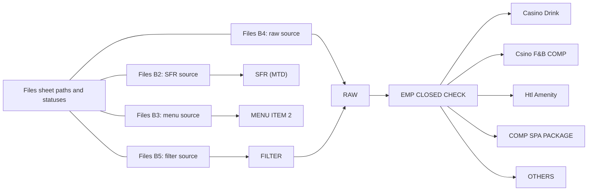

### Procedure inventory

All executable procedures are parameterless public `Sub` procedures. No VBA
`Function`, `Property`, or workbook event procedure is present.

| Module | Procedure | Main target | Status |
|---|---|---|---|
| `RUN.bas` | `RunMacro` | Import pipeline | Child status cells |
| `SFRMTD.bas` | `CopysfrSheet` | `SFR (MTD)` | `Files!C2` |
| `FILTERS.bas` | `CopyFilterSheet` | `FILTER` | `Files!C5` |
| `MENUITEM.bas` | `CopyMISheet` | `MENU ITEM 2` | `Files!C3` |
| `RAWSHEET.bas` | `CopyRAWSheet` | `RAW` | `Files!C4` |
| `EMP.bas` | `CopyECCSheet` | `EMP CLOSED CHECK` | `Files!C6` |
| `RUNN.bas` | `RunMacro2` | Category pipeline | Child status cells |
| `CASINODRINK.bas` | `CopyCDSheet` | `Casino Drink` | `Files!C7` |
| `FBCOMP.bas` | `CopyFBSheet` | `Csino F&B COMP` | `Files!C8` |
| `AMENITY.bas` | `CopyHASheet` | `Htl Amenity` | `Files!C9` |
| `SPA.bas` | `CopySPSheet` | `COMP SPA PACKAGE` | `Files!C10` |
| `OTHERS.bas` | `CopyOTHERSheet` | `OTHERS` | `Files!C11` |
| `FClear.bas` | `ClearSEM` | Four staging sheets | None |
| `Clearr.bas` | `Clear` | Nine staging/output sheets | None |
| `ThisWorkbook.bas` | None | Workbook metadata only | None |

### File and status map

| Cell | Meaning |
|---|---|
| `Files!B2` | Source workbook path used by `CopysfrSheet` |
| `Files!B3` | Source workbook path used by `CopyMISheet` |
| `Files!B4` | Source workbook path used by `CopyRAWSheet` |
| `Files!B5` | Source workbook path used by `CopyFilterSheet` |
| `Files!C2:C11` | Success or error messages for individual routines |

## RunMacro

**Source:** `exported_vba/RUN.bas` 
**Signature:** `Sub RunMacro()`

### Purpose

Runs the primary import pipeline in a fixed order. The order matters because
`CopyRAWSheet` depends on `FILTER`, and `CopyECCSheet` depends on `RAW`.

### Steps

| Order | Call | Dependency/result |
|---:|---|---|
| 1 | `CopysfrSheet` | Imports the SFR source from `Files!B2` |
| 2 | `CopyFilterSheet` | Builds `FILTER` from `Files!B5` |
| 3 | `CopyMISheet` | Builds `MENU ITEM 2` from `Files!B3` |
| 4 | `CopyRAWSheet` | Uses `Files!B4` and `FILTER` to build `RAW` |
| 5 | `CopyECCSheet` | Uses the `RAW` row count to expand `EMP CLOSED CHECK` |

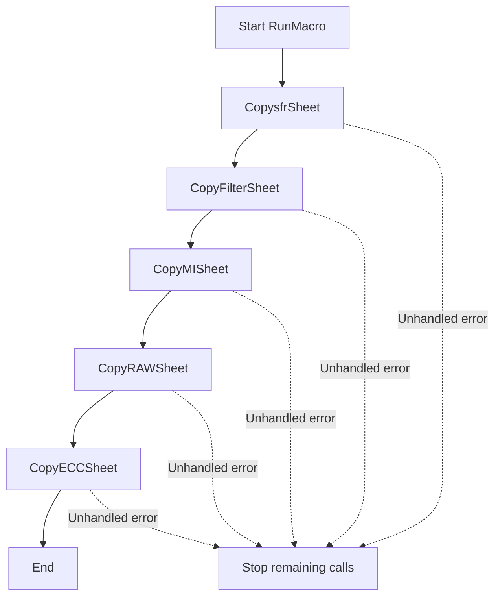

### Notes and risks

- The routine has no error handler and no combined success status.
- Most child routines catch errors, write an error status, and return. Therefore,
  this pipeline can continue using stale or partial data after a failed step.
- `ClearSEM` is not called. A shorter import can leave data from an earlier run.
- There is no rollback. Earlier successful imports remain if a later step fails.

## CopysfrSheet

**Source:** `exported_vba/SFRMTD.bas` 
**Signature:** `Sub CopysfrSheet()`

### Purpose

Opens the workbook path in `Files!B2` and imports two columns from its first
worksheet into `SFR (MTD)`.

### Data mapping

| Source | Destination |
|---|---|
| First sheet, `A1:A[last row in A]` | `SFR (MTD)!A1` |
| First sheet, `O1:O[last row in A]` | `SFR (MTD)!B1` |

Values, number formats, and formats are pasted. Formulas become values.

### Flow

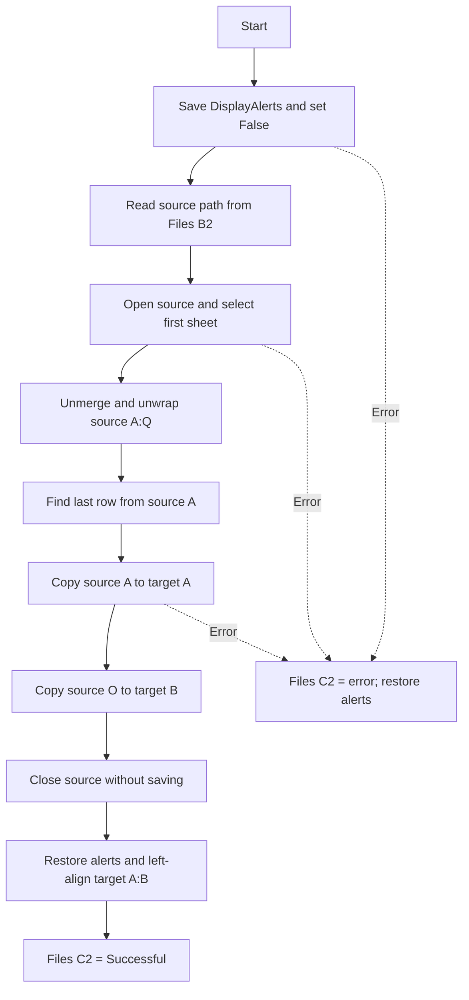

### Side effects and risks

- The source sheet's `A:Q` range is unmerged and unwrapped in memory. These
  changes are discarded on a normal close with `SaveChanges:=False`.
- An error after opening can leave the source workbook open with unsaved changes.
- Existing target rows below a shorter new import are not cleared.
- Source column A controls the last row for both imported columns.
- The first source worksheet is selected by position, not by name.
- Success or an error description is written to `Files!C2`.

## CopyFilterSheet

**Source:** `exported_vba/FILTERS.bas` 
**Signature:** `Sub CopyFilterSheet()`

### Purpose

Opens the workbook path in `Files!B5` and copies `A:C` from its first worksheet
to `FILTER!A1`. This sheet later provides criteria to `CopyRAWSheet` and
`CopyOTHERSheet`.

### Flow

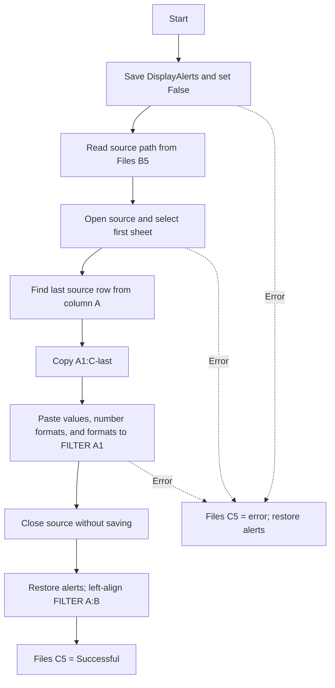

### Side effects and risks

- Source formulas are converted to values.
- Existing `FILTER` rows below the imported range are not cleared.
- Source column A determines the last row; lower data in B or C is ignored.
- An error after opening can leave the source workbook open.
- The routine changes entire destination columns A:B to left alignment.
- Success or an error description is written to `Files!C5`.

## CopyMISheet

**Source:** `exported_vba/MENUITEM.bas` 
**Signature:** `Sub CopyMISheet()`

### Purpose

Transforms the menu-item workbook from `Files!B3`, excludes records whose type
is `MODIFIER`, and imports the resulting records to `MENU ITEM 2`.

### Input and output

- The first source sheet is used.
- Source data is copied from `A11:AC[last row in Q]`.
- A temporary sheet named `NewSheetName` is added to the source workbook.
- Twelve unwanted columns are deleted from the temporary copy.
- Temporary/output column K, originally source column T, is filtered with
  `<>MODIFIER`.
- Visible temporary rows `A2:Q` are pasted to `MENU ITEM 2!A2`.
- The template in `MENU ITEM 2!S1` is copied down column S.

### Retained column mapping

| Output | Original source | Output | Original source |
|---|---|---|---|
| A | A | J | R |
| B | B | K | T |
| C | D | L | V |
| D | H | M | W |
| E | I | N | Y |
| F | K | O | Z |
| G | M | P | AA |
| H | P | Q | AC |
| I | Q |  |  |

### Flow

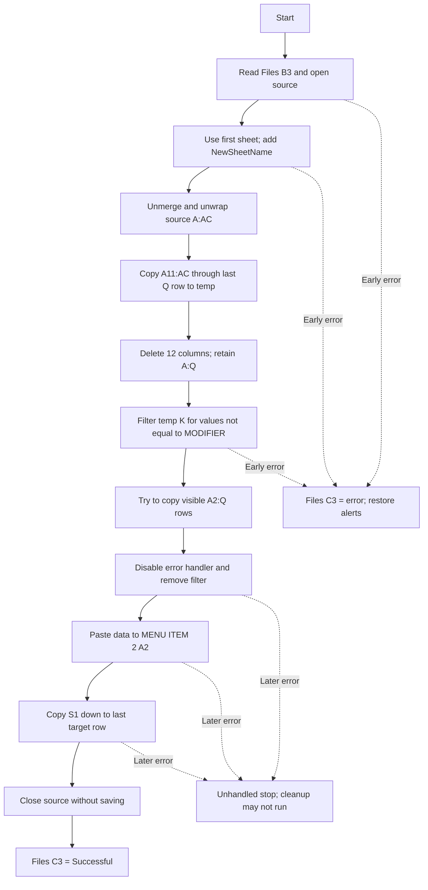

### Side effects and risks

- The original source sheet is unmerged in memory. The temporary sheet and all
  source changes are discarded only when the normal close is reached.
- A pre-existing source sheet named `NewSheetName` causes a naming error.
- After the visible-cell copy attempt, `On Error GoTo 0` disables the original
  handler. Later paste, close, or status errors are unhandled.
- If no visible rows exist, the copy error is ignored and the later paste can
  fail or use stale clipboard content.
- Existing target rows are not cleared. A shorter import can leave stale rows.
- The same values-and-number-formats paste is performed twice.
- Success or an error description is intended for `Files!C3`.

## CopyRAWSheet

**Source:** `exported_vba/RAWSHEET.bas` 
**Signature:** `Sub CopyRAWSheet()`

### Purpose

Transforms the external workbook in `Files!B4`, filters it using criteria from
`FILTER!A:A`, and imports the result to `RAW!A2`.

### Transformation

1. Use the first source worksheet.
2. Add a temporary worksheet named `NewSheetName`.
3. Unmerge source columns A:AN.
4. Copy source `A6:AN[last row in V]` to the temporary sheet as values/formats.
5. Delete original columns C:G from the temporary copy.
6. Filter temporary field 17, column Q, which corresponds to original column V.
7. Copy temporary `A2:AI[last row in A]` to `RAW!A2`.

### Criteria

The macro scans `FILTER!A1:A[last row]`, compacts nonblank values into an array,
and passes the array to AutoFilter with `xlFilterValues`.

### Flow

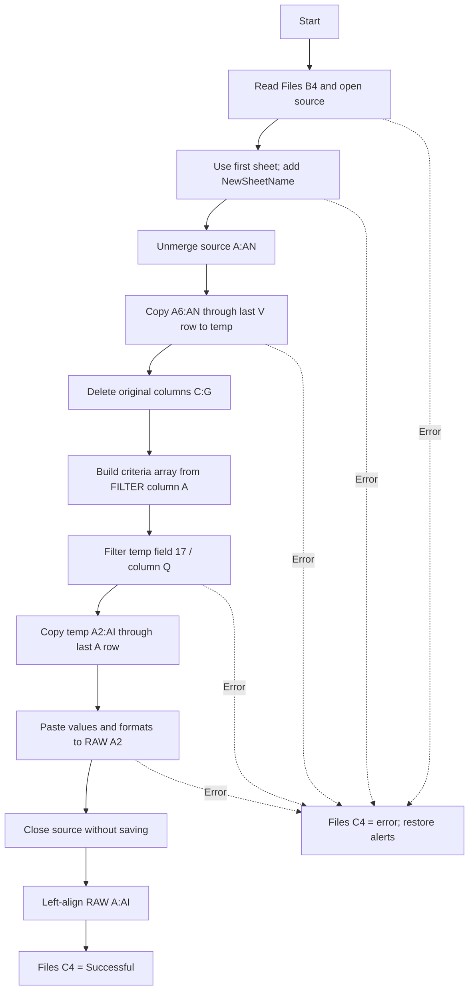

### Side effects and risks

- The temporary field mapping after deleting C:G is A, B, H through AN.
- The filter header is temporary row 1; data copied to `RAW` begins at row 2.
- The copied range is not explicitly limited with
  `SpecialCells(xlCellTypeVisible)`. The routine relies on Excel's filtered-range
  copy behavior.
- The criteria array is sized to the last row number rather than the count of
  nonblank criteria, so blank array elements can remain.
- `Application.ScreenUpdating` is set to `False` and is not restored.
- Existing RAW data below a shorter new import is not cleared.
- On error, the source can remain open after being unmerged and modified in
  memory.
- Success or an error description is written to `Files!C4`.

## CopyECCSheet

**Source:** `exported_vba/EMP.bas` 
**Signature:** `Sub CopyECCSheet()`

### Purpose

Counts records in `RAW`, stores the count in `RAW!AP1`, and expands the template
row `EMP CLOSED CHECK!A3:L3` to create one template row per RAW record.

### Calculations

| Value | Calculation |
|---|---|
| `RowCount` | Last used row in `RAW` column A |
| `totalRows` | `RowCount - 1`, with a minimum of zero |
| `lastRow` | `totalRows + 2`, equivalent to `RowCount + 1` |
| Paste target | `EMP CLOSED CHECK!A4:L[lastRow]` |

### Flow

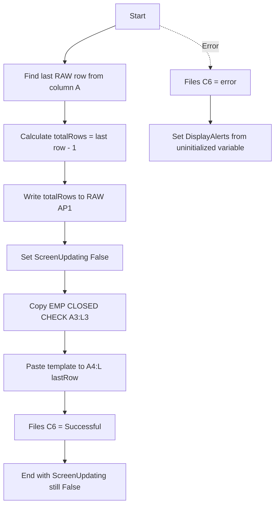

### Side effects and risks

- All `Sheets(...)` references are unqualified and resolve against the active
  workbook, not necessarily `ThisWorkbook`.
- `Application.ScreenUpdating` is disabled and never restored.
- For zero or one RAW record, the target has reversed endpoints such as
  `A4:L2` or `A4:L3`. Excel treats these as real rectangular ranges and may
  overwrite unintended rows.
- The error handler assigns an uninitialized `originalDisplayAlerts` variable
  to `Application.DisplayAlerts`, which can leave alerts disabled.
- Existing template rows beyond the new end are not cleared.
- Success or an error description is written to `Files!C6`.

## RunMacro2

**Source:** `exported_vba/RUNN.bas` 
**Signature:** `Sub RunMacro2()`

### Purpose

Runs the five category-copy routines in order. It does not import the raw data
or build `EMP CLOSED CHECK`; that work belongs to `RunMacro`.

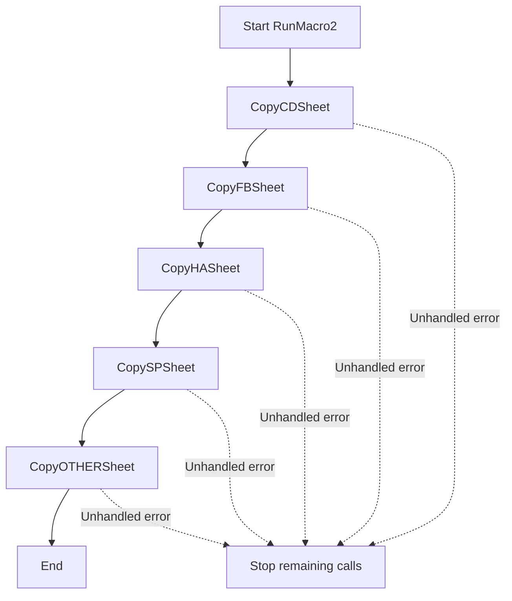

### Notes and risks

- The routine has no aggregate status and does not inspect child status cells.
- A handled child error normally allows the next child to run.
- Repeated runs can append duplicate category records.
- The final child, `CopyOTHERSheet`, leaves screen updating disabled.

## Category routines

The five category routines use the same general pattern:

1. Filter `EMP CLOSED CHECK!A2:L[last row in B]` on field 4, source column D.
2. Copy visible `B3:K[last row]`.
3. Paste values and number formats into the category sheet.
4. Fill target column A with yesterday's date as `mm/dd/yyyy`.
5. Copy a category-specific formula/template range to column L.
6. Convert the target column-L cells to values.
7. Remove the source filter and write a status.

If existing target data is present, these routines calculate a row after the
last row and then paste one additional row below that, leaving a blank separator
row. Existing source filter settings are removed rather than restored.

### Category configuration

| Procedure | Filter criterion | Target/start | Template | Status |
|---|---|---|---|---|
| `CopyCDSheet` | Contains `COMP Casino Drink` | `Casino Drink!B9` | `L5:O5` | `Files!C7` |
| `CopyFBSheet` | Contains `COMP Csino-F&B` | `Csino F&B COMP!B11` | `L7:R7` | `Files!C8` |
| `CopyHASheet` | Contains `COMP Htl Amnty` | `Htl Amenity!B11` | `L8:P8` | `Files!C9` |
| `CopySPSheet` | Contains `Spa FD Pkg` | `COMP SPA PACKAGE!B9` | `L6` | `Files!C10` |
| `CopyOTHERSheet` | Values from `FILTER!C:C` | `OTHERS!B9` | `L6:M6` | `Files!C11` |

## CopyCDSheet

**Source:** `exported_vba/CASINODRINK.bas` 
**Signature:** `Sub CopyCDSheet()`

### Purpose

Appends rows classified as `COMP Casino Drink` to `Casino Drink`.

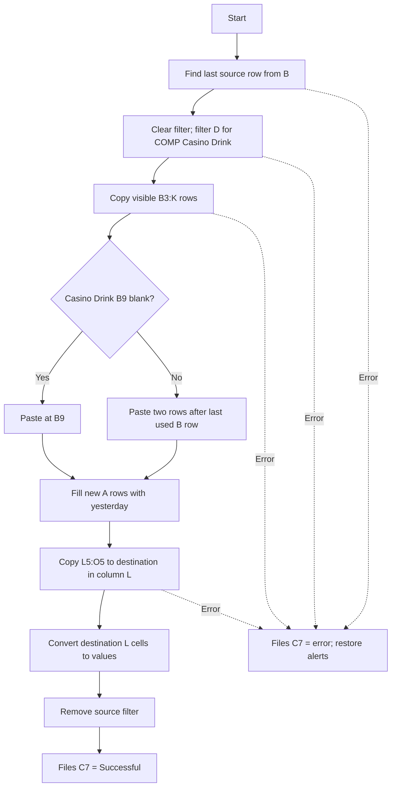

### Important behavior

- The source B:K values and number formats map to target B:K.
- The horizontal four-cell template `L5:O5` is pasted to a one-column vertical
  destination. For multiple output rows, this shape mismatch can cause error
  1004. Data and dates pasted before that failure are not rolled back.
- Only column L is converted to values; formulas pasted into M:O can remain.
- No visible source records can make `SpecialCells(xlCellTypeVisible)` fail.

## CopyFBSheet

**Source:** `exported_vba/FBCOMP.bas` 
**Signature:** `Sub CopyFBSheet()`

### Purpose

Appends rows classified as `COMP Csino-F&B` to `Csino F&B COMP`. The spelling
`Csino` is used exactly this way in both code and sheet names.

### Important behavior

- The seven-column template `L7:R7` is pasted to a one-column destination, which
  can fail for multiple output rows.
- Only destination column L is converted to values; M:R can retain formulas.
- Existing filters are destroyed, and partial writes remain after an error.

## CopyHASheet

**Source:** `exported_vba/AMENITY.bas` 
**Signature:** `Sub CopyHASheet()`

### Purpose

Appends rows classified as `COMP Htl Amnty` to `Htl Amenity`.

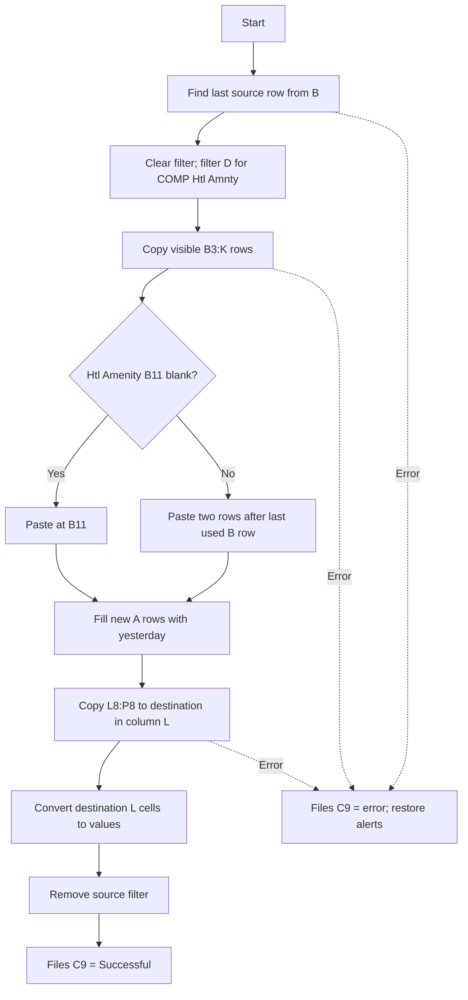

### Important behavior

- The five-column template `L8:P8` is pasted to a one-column destination, which
  can fail for multiple output rows.
- Only destination column L is converted to values; M:P can retain formulas.
- The routine activates `Htl Amenity` and selects A1.

## CopySPSheet

**Source:** `exported_vba/SPA.bas` 
**Signature:** `Sub CopySPSheet()`

### Purpose

Appends rows classified as `Spa FD Pkg` to `COMP SPA PACKAGE`.

### Important behavior

- Unlike the other category templates, `L6` is a single cell and naturally
  fills the one-column destination.
- The formula result is frozen without forcing calculation first. In manual
  calculation mode, a stale result can be stored.
- Existing source filter criteria are not preserved.

## CopyOTHERSheet

**Source:** `exported_vba/OTHERS.bas` 
**Signature:** `Sub CopyOTHERSheet()`

### Purpose

Appends source rows whose column-D value matches any nonblank criterion in
`FILTER!C:C` to `OTHERS`.

### Flow

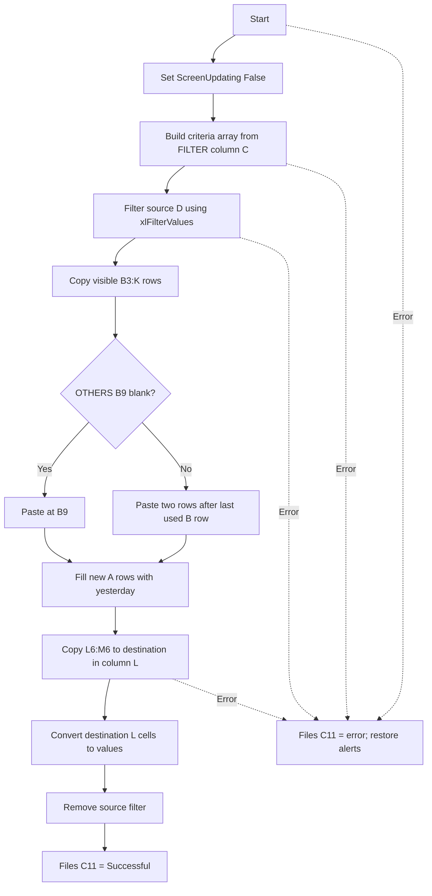

### Important behavior

- Criteria scanning begins at row 1, so a heading in `FILTER!C1` is also used as
  a criterion.
- The criteria array can contain trailing empty elements when FILTER has blanks.
- Unlike the other category routines, it does not explicitly clear the source's
  existing AutoFilter before applying its filter.
- The two-column template `L6:M6` is pasted to a one-column destination.
- `Application.ScreenUpdating` is disabled and never restored.

## ClearSEM

**Source:** `exported_vba/FClear.bas` 
**Signature:** `Sub ClearSEM()`

### Purpose

Clears the four sheets used by the primary import pipeline while retaining cell
formatting. Active filters are first changed to show all data.

### Clear ranges

| Sheet | Last-row basis | Cleared contents |
|---|---|---|
| `SFR (MTD)` | None | Entire columns A:B, including headers |
| `MENU ITEM 2` | Column A | `A2:S[last row]` |
| `RAW` | Column A | `A2:AO[last row]` |
| `EMP CLOSED CHECK` | Column B | `A4:M[last row]` and `M3` |

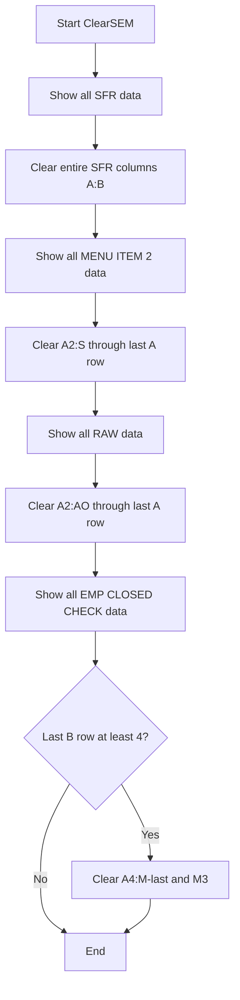

### Side effects and risks

- The SFR selection and clear statements are unqualified. If another workbook is
  active, the code can fail or clear a similarly named sheet in that workbook.
- The entire SFR A:B columns are cleared, including row 1.
- There is no error handler; an error leaves later sheets uncleared.
- Last rows are based on only one key column, so lower data in other columns can
  remain.
- `RAW!AP1`, used by `CopyECCSheet`, is not cleared.

## Clear

**Source:** `exported_vba/Clearr.bas` 
**Signature:** `Sub Clear()`

### Purpose

Performs a broader reset than `ClearSEM`, clearing staging data plus all five
category sheets. `ClearContents` removes values and formulas but preserves cell
formats, validation, comments, and row/column sizes.

### Clear ranges

| Sheet | Last-row basis | Cleared contents |
|---|---|---|
| `SFR (MTD)` | None | Entire columns A:B |
| `MENU ITEM 2` | A | `A2:S[last row]` |
| `RAW` | A | `A2:AO[last row]` |
| `Casino Drink` | A | `A8:R[last row]` |
| `Csino F&B COMP` | A | `A10:T[last row]` |
| `Htl Amenity` | A | `A10:R[last row]` |
| `COMP SPA PACKAGE` | A | `A8:N[last row]` |
| `OTHERS` | A | `A8:N[last row]` |
| `EMP CLOSED CHECK` | B | `A4:L[last row]` |

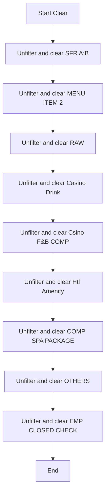

### Side effects and risks

- The SFR select/clear statements are unqualified and can address the active
  workbook instead of `ThisWorkbook`.
- There is no error handler or rollback. One error stops all later clearing.
- Key-column last-row checks can leave stale cells below the detected boundary.
- The filter criteria are cleared with `ShowAllData`, but filter arrows normally
  remain.
- `RAW!AP1` is outside the clear range and remains unchanged.

## ThisWorkbook module

**Source:** `exported_vba/ThisWorkbook.bas`

This file contains only exported component attributes that identify Excel's
workbook document module. It contains no executable procedures and no workbook
events such as `Workbook_Open`, `Workbook_BeforeClose`, or
`Workbook_SheetChange`. A per-function flowchart is therefore not applicable.

## Important implementation notes

### Shared reliability concerns

- No module contains `Option Explicit`. Undeclared names silently become local
  Variant variables, which makes misspellings harder to detect.
- Several procedures change application-wide settings such as `DisplayAlerts`
  and `ScreenUpdating`. Some paths do not restore those settings.
- External workbooks are not opened read-only, and events are not disabled.
- Error handlers generally report an error but do not close open source
  workbooks, clear filters, undo partial output, or re-raise the error.
- The import and category routines do not clear old destination data first.
- Many last-row calculations depend on one column and assume contiguous data.
- Several comments in the VBA exports describe different cells or ranges from
  those actually used. This document follows the executable code.

### Recommended operating order

The existing code does not enforce this order, but it best matches its data
dependencies:

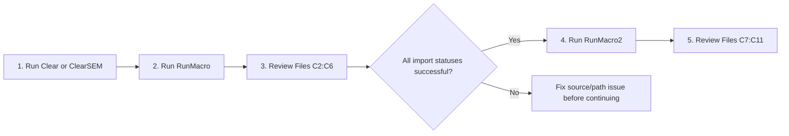

This sequence is documentation only; no VBA code was changed to automate or
enforce it.
