# Exported VBA Code Documentation

This document describes the VBA code in `exported_vba`. It is based on static
analysis of the exported modules; the macros were not executed against a live
workbook. Sheet names, ranges, file-path cells, and status cells are written
exactly as used by the code.

The diagrams use Mermaid syntax. GitHub, GitLab, Obsidian, VS Code extensions,
and other Mermaid-compatible Markdown viewers render them as flowcharts.

## Contents

- [System overview](#system-overview)
- [RunMacro](#runmacro)
- [CopysfrSheet](#copysfrsheet)
- [CopyFilterSheet](#copyfiltersheet)
- [CopyMISheet](#copymisheet)
- [CopyRAWSheet](#copyrawsheet)
- [CopyECCSheet](#copyeccsheet)
- [RunMacro2](#runmacro2)
- [CopyCDSheet](#copycdsheet)
- [CopyFBSheet](#copyfbsheet)
- [CopyHASheet](#copyhasheet)
- [CopySPSheet](#copyspsheet)
- [CopyOTHERSheet](#copyothersheet)
- [ClearSEM](#clearsem)
- [Clear](#clear)
- [ThisWorkbook module](#thisworkbook-module)
- [Important implementation notes](#important-implementation-notes)

## System overview

The project has two main processing pipelines:

1. `RunMacro` imports four external files and builds `EMP CLOSED CHECK`.
2. `RunMacro2` divides records from `EMP CLOSED CHECK` among five category
   sheets.

The clear macros are separate. Neither run macro clears old data automatically.

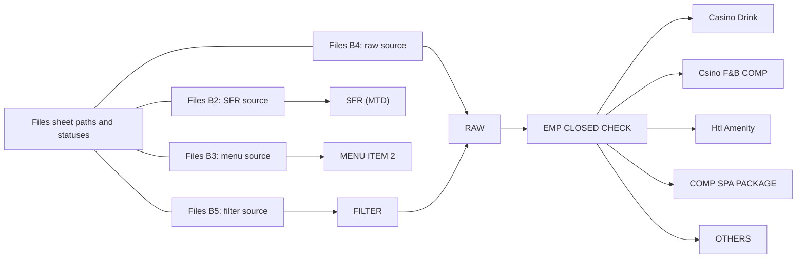
```mermaid
flowchart LR
    Files["Files sheet paths and statuses"]
    SFRFile["Files B2: SFR source"]
    MenuFile["Files B3: menu source"]
    RawFile["Files B4: raw source"]
    FilterFile["Files B5: filter source"]

    SFRFile --> SFR["SFR (MTD)"]
    MenuFile --> Menu["MENU ITEM 2"]
    FilterFile --> Filter["FILTER"]
    RawFile --> Raw["RAW"]
    Filter --> Raw
    Raw --> Emp["EMP CLOSED CHECK"]

    Emp --> Drink["Casino Drink"]
    Emp --> FB["Csino F&B COMP"]
    Emp --> Amenity["Htl Amenity"]
    Emp --> Spa["COMP SPA PACKAGE"]
    Emp --> Others["OTHERS"]

    Files --- SFRFile
    Files --- MenuFile
    Files --- RawFile
    Files --- FilterFile
```

### Procedure inventory

All executable procedures are parameterless public `Sub` procedures. No VBA
`Function`, `Property`, or workbook event procedure is present.

| Module | Procedure | Main target | Status |
|---|---|---|---|
| `RUN.bas` | `RunMacro` | Import pipeline | Child status cells |
| `SFRMTD.bas` | `CopysfrSheet` | `SFR (MTD)` | `Files!C2` |
| `FILTERS.bas` | `CopyFilterSheet` | `FILTER` | `Files!C5` |
| `MENUITEM.bas` | `CopyMISheet` | `MENU ITEM 2` | `Files!C3` |
| `RAWSHEET.bas` | `CopyRAWSheet` | `RAW` | `Files!C4` |
| `EMP.bas` | `CopyECCSheet` | `EMP CLOSED CHECK` | `Files!C6` |
| `RUNN.bas` | `RunMacro2` | Category pipeline | Child status cells |
| `CASINODRINK.bas` | `CopyCDSheet` | `Casino Drink` | `Files!C7` |
| `FBCOMP.bas` | `CopyFBSheet` | `Csino F&B COMP` | `Files!C8` |
| `AMENITY.bas` | `CopyHASheet` | `Htl Amenity` | `Files!C9` |
| `SPA.bas` | `CopySPSheet` | `COMP SPA PACKAGE` | `Files!C10` |
| `OTHERS.bas` | `CopyOTHERSheet` | `OTHERS` | `Files!C11` |
| `FClear.bas` | `ClearSEM` | SFR clear and staging unfilter | None |
| `Clearr.bas` | `Clear` | SFR/category clear and staging unfilter | None |
| `ThisWorkbook.bas` | None | Workbook metadata only | None |

### File and status map

| Cell | Meaning |
|---|---|
| `Files!B2` | Source workbook path used by `CopysfrSheet` |
| `Files!B3` | Source workbook path used by `CopyMISheet` |
| `Files!B4` | Source workbook path used by `CopyRAWSheet` |
| `Files!B5` | Source workbook path used by `CopyFilterSheet` |
| `Files!B28` | Processing date written to imported and category records |
| `Files!C2:C11` | Success or error messages for individual routines |

## RunMacro

**Source:** `exported_vba/RUN.bas` 
**Signature:** `Sub RunMacro()`

### Purpose

Runs the primary import pipeline in a fixed order. The order matters because
`CopyRAWSheet` depends on `FILTER`, and `CopyECCSheet` depends on `RAW`.
Before the imports begin, every worksheet in `ThisWorkbook` is unfiltered with
`ShowAllData`. This reveals all rows while retaining AutoFilter dropdowns.

### Steps

| Order | Call | Dependency/result |
|---:|---|---|
| 1 | Preflight unfilter | Shows all rows on every `ThisWorkbook` worksheet |
| 2 | `CopysfrSheet` | Imports the SFR source from `Files!B2` |
| 3 | `CopyFilterSheet` | Builds `FILTER` from `Files!B5` |
| 4 | `CopyMISheet` | Appends to `MENU ITEM 2` from `Files!B3` |
| 5 | `CopyRAWSheet` | Uses `Files!B4` and `FILTER` to append to `RAW` |
| 6 | `CopyECCSheet` | Appends the latest RAW batch to `EMP CLOSED CHECK` |

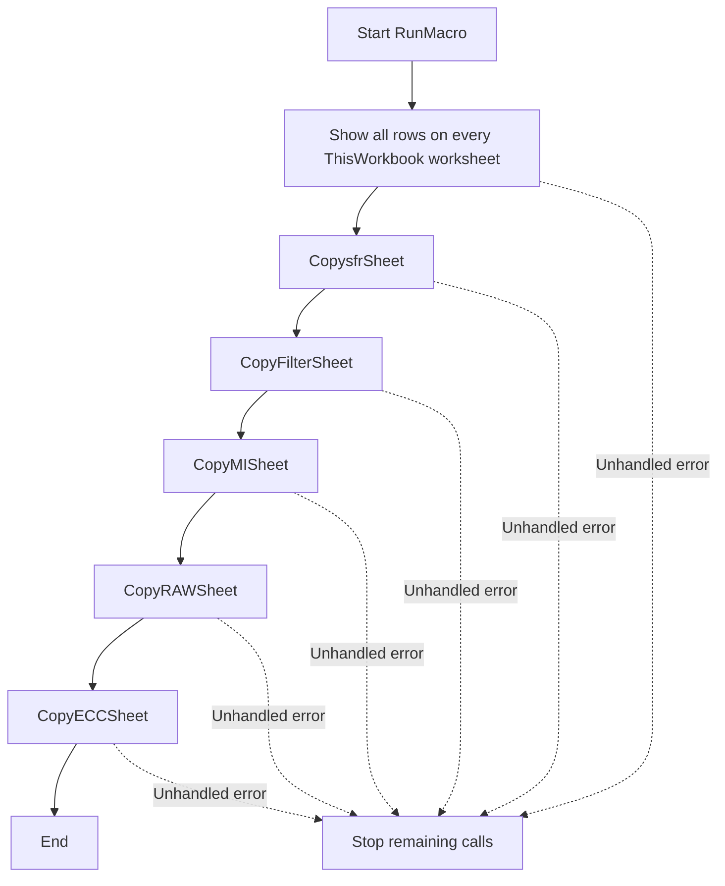
```mermaid
flowchart TD
    A["Start RunMacro"] --> B["Show all rows on every ThisWorkbook worksheet"]
    B --> C["CopysfrSheet"]
    C --> D["CopyFilterSheet"]
    D --> E["CopyMISheet"]
    E --> F["CopyRAWSheet"]
    F --> G["CopyECCSheet"]
    G --> H["End"]
    B -. "Unhandled error" .-> X["Stop remaining calls"]
    C -. "Unhandled error" .-> X
    D -. "Unhandled error" .-> X
    E -. "Unhandled error" .-> X
    F -. "Unhandled error" .-> X
    G -. "Unhandled error" .-> X
```

### Notes and risks

- The routine has no error handler and no combined success status.
- The preflight removes active filter criteria but leaves filter dropdowns in
  place. It only affects worksheets in `ThisWorkbook`, not external workbooks
  opened later by child routines.
- Most child routines catch errors, write an error status, and return. Therefore,
  this pipeline can continue using stale or partial data after a failed step.
- Menu, RAW, and EMP imports append by design; rerunning the same sources creates
  duplicate accumulated records.
- There is no rollback. Earlier successful imports remain if a later step fails.

## CopysfrSheet

**Source:** `exported_vba/SFRMTD.bas` 
**Signature:** `Sub CopysfrSheet()`

### Purpose

Opens the workbook path in `Files!B2` and imports two columns from its first
worksheet into `SFR (MTD)`.

### Data mapping

| Source | Destination |
|---|---|
| First sheet, `A1:A[last row in A]` | `SFR (MTD)!A1` |
| First sheet, `O1:O[last row in A]` | `SFR (MTD)!B1` |

Values, number formats, and formats are pasted. Formulas become values.

### Flow

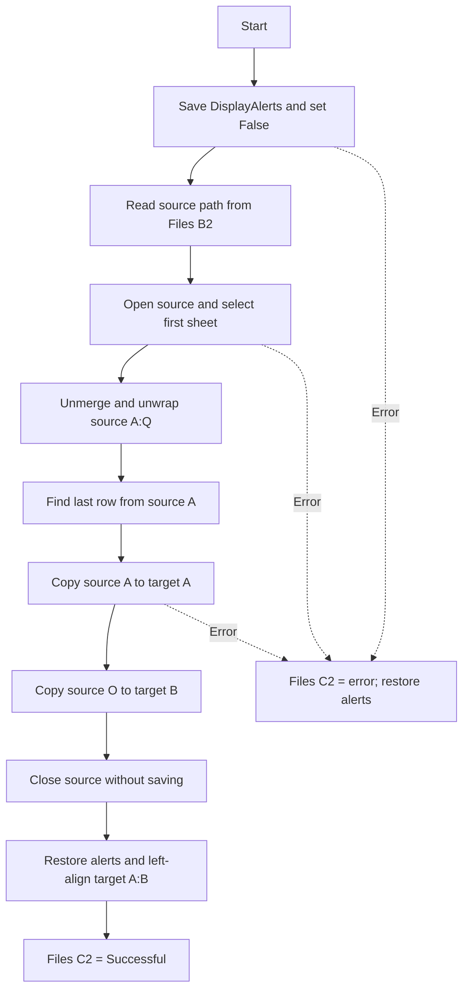
```mermaid
flowchart TD
    A["Start"] --> B["Save DisplayAlerts and set False"]
    B --> C["Read source path from Files B2"]
    C --> D["Open source and select first sheet"]
    D --> E["Unmerge and unwrap source A:Q"]
    E --> F["Find last row from source A"]
    F --> G["Copy source A to target A"]
    G --> H["Copy source O to target B"]
    H --> I["Close source without saving"]
    I --> J["Restore alerts and left-align target A:B"]
    J --> K["Files C2 = Successful"]
    B -. "Error" .-> X["Files C2 = error; restore alerts"]
    D -. "Error" .-> X
    G -. "Error" .-> X
```

### Side effects and risks

- The source sheet's `A:Q` range is unmerged and unwrapped in memory. These
  changes are discarded on a normal close with `SaveChanges:=False`.
- An error after opening can leave the source workbook open with unsaved changes.
- Existing target rows below a shorter new import are not cleared.
- Source column A controls the last row for both imported columns.
- The first source worksheet is selected by position, not by name.
- Success or an error description is written to `Files!C2`.

## CopyFilterSheet

**Source:** `exported_vba/FILTERS.bas` 
**Signature:** `Sub CopyFilterSheet()`

### Purpose

Opens the workbook path in `Files!B5` and copies `A:C` from its first worksheet
to `FILTER!A1`. This sheet later provides criteria to `CopyRAWSheet` and
`CopyOTHERSheet`.

### Flow

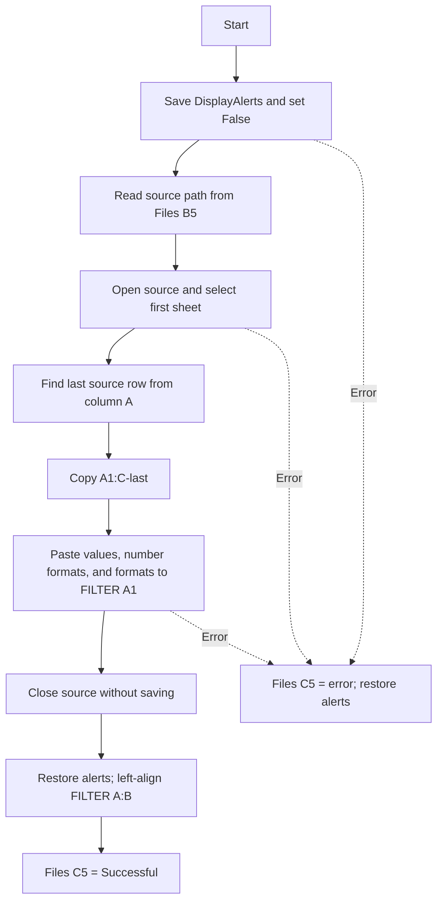
```mermaid
flowchart TD
    A["Start"] --> B["Save DisplayAlerts and set False"]
    B --> C["Read source path from Files B5"]
    C --> D["Open source and select first sheet"]
    D --> E["Find last source row from column A"]
    E --> F["Copy A1:C-last"]
    F --> G["Paste values, number formats, and formats to FILTER A1"]
    G --> H["Close source without saving"]
    H --> I["Restore alerts; left-align FILTER A:B"]
    I --> J["Files C5 = Successful"]
    B -. "Error" .-> X["Files C5 = error; restore alerts"]
    D -. "Error" .-> X
    G -. "Error" .-> X
```

### Side effects and risks

- Source formulas are converted to values.
- Existing `FILTER` rows below the imported range are not cleared.
- Source column A determines the last row; lower data in B or C is ignored.
- An error after opening can leave the source workbook open.
- The routine changes entire destination columns A:B to left alignment.
- Success or an error description is written to `Files!C5`.

## CopyMISheet

**Source:** `exported_vba/MENUITEM.bas` 
**Signature:** `Sub CopyMISheet()`

### Purpose

Transforms the menu-item workbook from `Files!B3`, excludes records whose type
is `MODIFIER`, and imports the resulting records to `MENU ITEM 2`.

### Input and output

- The first source sheet is used.
- Source data is copied from `A11:AC[last row in Q]`.
- A temporary sheet named `NewSheetName` is added to the source workbook.
- Twelve unwanted columns are deleted from the temporary copy.
- Temporary/output column K, originally source column T, is filtered with
  `<>MODIFIER`.
- Visible temporary rows `A2:Q` are appended after the last populated target
  column-A row, with row 2 as the minimum destination.
- The template in `MENU ITEM 2!S1` is copied only to the newly appended rows.
- New column-T rows receive the formatted processing date from `Files!B28`.

### Retained column mapping

| Output | Original source | Output | Original source |
|---|---|---|---|
| A | A | J | R |
| B | B | K | T |
| C | D | L | V |
| D | H | M | W |
| E | I | N | Y |
| F | K | O | Z |
| G | M | P | AA |
| H | P | Q | AC |
| I | Q |  |  |

### Flow

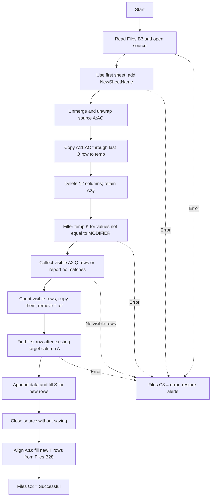
```mermaid
flowchart TD
    A["Start"] --> B["Read Files B3 and open source"]
    B --> C["Use first sheet; add NewSheetName"]
    C --> D["Unmerge and unwrap source A:AC"]
    D --> E["Copy A11:AC through last Q row to temp"]
    E --> F["Delete 12 columns; retain A:Q"]
    F --> G["Filter temp K for values not equal to MODIFIER"]
    G --> H["Collect visible A2:Q rows or report no matches"]
    H --> I["Count visible rows; copy them; remove filter"]
    I --> J["Find first row after existing target column A"]
    J --> K["Append data and fill S for new rows"]
    K --> L["Close source without saving"]
    L --> M["Align A:B; fill new T rows from Files B28"]
    M --> N["Files C3 = Successful"]
    B -. "Error" .-> X["Files C3 = error; restore alerts"]
    C -. "Error" .-> X
    G -. "Error" .-> X
    H -. "No visible rows" .-> X
    J -. "Error" .-> X
```

### Side effects and risks

- The original source sheet is unmerged in memory. The temporary sheet and all
  source changes are discarded only when the normal close is reached.
- A pre-existing source sheet named `NewSheetName` causes a naming error.
- If no visible rows exist, the routine reports an error instead of attempting a
  paste or using old clipboard data.
- Visible areas are counted before the paste, so S and T use the exact imported
  batch size rather than relying on every new column-A cell being populated.
- Existing target rows are retained, so importing the same source repeatedly
  appends duplicate records.
- Column S formulas and column T dates are limited to the current appended batch.
- Success or an error description is intended for `Files!C3`.

## CopyRAWSheet

**Source:** `exported_vba/RAWSHEET.bas` 
**Signature:** `Sub CopyRAWSheet()`

### Purpose

Transforms the external workbook in `Files!B4`, filters it using criteria from
`FILTER!A:A`, and appends the result to `RAW`.

### Transformation

1. Reset `RAW!AP2:AP3` to zero so a failed import cannot reuse stale bounds.
2. Open the source and use its first worksheet.
3. Add a temporary worksheet named `NewSheetName`.
4. Unmerge source columns A:AN.
5. Copy source `A6:AN[last row in V]` to the temporary sheet as values/formats.
6. Delete original columns C:G from the temporary copy.
7. Filter temporary field 17, column Q, which corresponds to original column V.
8. Explicitly collect and count visible temporary `A2:AI` rows.
9. Append those rows after the final populated RAW
   column-A row, with row 2 as the minimum destination.
10. Fill column AO for the new rows from `Files!B28`.
11. Record the successful batch boundaries in `RAW!AP2:AP3`.

### Criteria

The macro scans `FILTER!A1:A[last row]`, compacts nonblank values into an array,
and passes the array to AutoFilter with `xlFilterValues`.

### Flow

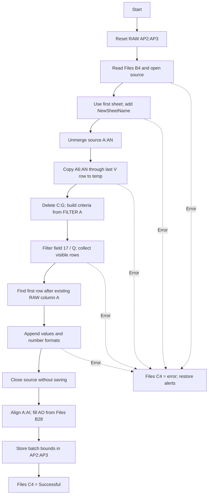
```mermaid
flowchart TD
    A["Start"] --> B["Reset RAW AP2:AP3"]
    B --> C["Read Files B4 and open source"]
    C --> D["Use first sheet; add NewSheetName"]
    D --> E["Unmerge source A:AN"]
    E --> F["Copy A6:AN through last V row to temp"]
    F --> G["Delete C:G; build criteria from FILTER A"]
    G --> H["Filter field 17 / Q; collect visible rows"]
    H --> I["Find first row after existing RAW column A"]
    I --> J["Append values and number formats"]
    J --> K["Close source without saving"]
    K --> L["Align A:AI; fill AO from Files B28"]
    L --> M["Store batch bounds in AP2:AP3"]
    M --> N["Files C4 = Successful"]
    C -. "Error" .-> X["Files C4 = error; restore alerts"]
    D -. "Error" .-> X
    F -. "Error" .-> X
    H -. "Error" .-> X
    J -. "Error" .-> X
```

### Side effects and risks

- The temporary field mapping after deleting C:G is A, B, H through AN.
- The filter header is temporary row 1; the first import begins at RAW row 2 and
  later imports append after existing column-A data.
- The copied range is explicitly limited to visible cells. No-match errors are
  reported before any paste occurs.
- The criteria array is sized to the last row number rather than the count of
  nonblank criteria, so blank array elements can remain.
- `Application.ScreenUpdating` is set to `False` and is not restored.
- Existing RAW rows are retained, so importing the same source repeatedly
  appends duplicate records.
- Column AO identifies each new row's processing date. AP2 and AP3 identify the
  first and last rows of the latest appended batch.
- AP2 and AP3 are reset to zero before import. If RAW import fails, the following
  `CopyECCSheet` call rejects those invalid bounds instead of reusing an old batch.
- On error, the source can remain open after being unmerged and modified in
  memory.
- Success or an error description is written to `Files!C4`.

## CopyECCSheet

**Source:** `exported_vba/EMP.bas` 
**Signature:** `Sub CopyECCSheet()`

### Purpose

Counts records in `RAW`, stores the total in `RAW!AP1`, and appends template rows
to `EMP CLOSED CHECK` for only the latest RAW batch identified by `RAW!AP2:AP3`.

### Calculations

| Value | Calculation |
|---|---|
| `rowCount` | Last used row in `RAW` column A |
| `totalRows` | `rowCount - 1`, written to `RAW!AP1` |
| `rawFirstRow` | Latest RAW batch start from `RAW!AP2` |
| `rawLastRow` | Latest RAW batch end from `RAW!AP3` |
| `firstTargetRow` | Row after the last populated EMP column-B row, minimum 4 |
| Paste target | New rows in `EMP CLOSED CHECK!A:L` only |

### Flow

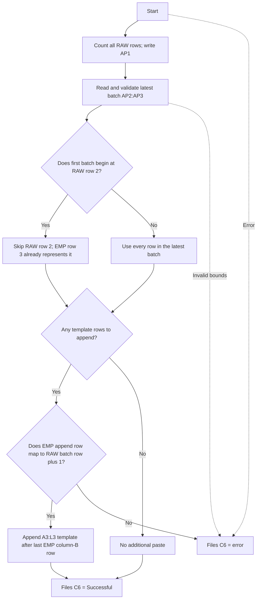
```mermaid
flowchart TD
    A["Start"] --> B["Count all RAW rows; write AP1"]
    B --> C["Read and validate latest batch AP2:AP3"]
    C --> D{"Does first batch begin at RAW row 2?"}
    D -- "Yes" --> E["Skip RAW row 2; EMP row 3 already represents it"]
    D -- "No" --> F["Use every row in the latest batch"]
    E --> G{"Any template rows to append?"}
    F --> G
    G -- "Yes" --> H{"Does EMP append row map to RAW batch row plus 1?"}
    G -- "No" --> I["No additional paste"]
    H -- "Yes" --> K["Append A3:L3 template after last EMP column-B row"]
    H -- "No" --> X["Files C6 = out-of-sync error"]
    K --> J["Files C6 = Successful"]
    I --> J
    A -. "Error" .-> X["Files C6 = error"]
    C -. "Invalid bounds" .-> X
```

### Side effects and risks

- When rows are appended, `Application.ScreenUpdating` is disabled and never
  restored. An initial one-row batch performs no EMP paste and does not change it.
- Missing, nonnumeric, reversed, or out-of-range AP2/AP3 boundaries produce an
  error status instead of pasting.
- Before appending, the routine requires the next EMP row to equal the first RAW
  row being processed plus one. This preserves relative formula mapping and
  blocks duplicate reruns or desynchronized sheets.
- On the first batch, existing template row 3 represents RAW row 2; only the
  remaining batch rows are appended from row 4 onward.
- Success or an error description is written to `Files!C6`.

## RunMacro2

**Source:** `exported_vba/RUNN.bas` 
**Signature:** `Sub RunMacro2()`

### Purpose

Runs the five category-copy routines in order. It does not import the raw data
or build `EMP CLOSED CHECK`; that work belongs to `RunMacro`.

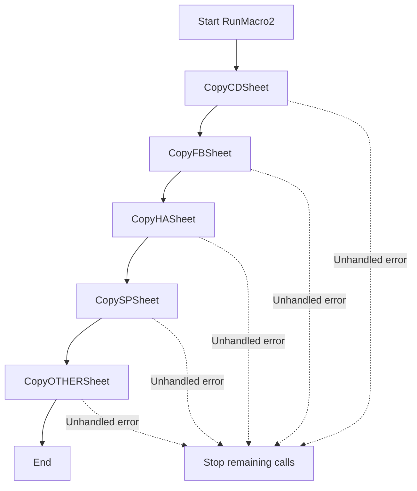
```mermaid
flowchart TD
    A["Start RunMacro2"] --> B["CopyCDSheet"]
    B --> C["CopyFBSheet"]
    C --> D["CopyHASheet"]
    D --> E["CopySPSheet"]
    E --> F["CopyOTHERSheet"]
    F --> G["End"]
    B -. "Unhandled error" .-> X["Stop remaining calls"]
    C -. "Unhandled error" .-> X
    D -. "Unhandled error" .-> X
    E -. "Unhandled error" .-> X
    F -. "Unhandled error" .-> X
```

### Notes and risks

- The routine has no aggregate status and does not inspect child status cells.
- A handled child error normally allows the next child to run.
- Repeated runs can append duplicate category records.
- The final child, `CopyOTHERSheet`, leaves screen updating disabled.

## Category routines

The five category routines use the same general pattern:

1. Filter `EMP CLOSED CHECK!A2:L[last row in B]` on field 4, source column D.
2. Copy visible `B3:K[last row]`.
3. Paste values and number formats into the category sheet.
4. Fill target column A with `Files!B28` formatted as `mm/dd/yyyy`.
5. Copy a category-specific formula/template range to column L.
6. Convert the target column-L cells to values.
7. Remove the source filter and write a status.

If existing target data is present, these routines calculate a row after the
last row and then paste one additional row below that, leaving a blank separator
row. Existing source filter settings are removed rather than restored.

### Category configuration

| Procedure | Filter criterion | Target/start | Template | Status |
|---|---|---|---|---|
| `CopyCDSheet` | Contains `COMP Casino Drink` | `Casino Drink!B9` | `L5:O5` | `Files!C7` |
| `CopyFBSheet` | Contains `COMP Csino-F&B` | `Csino F&B COMP!B11` | `L7:R7` | `Files!C8` |
| `CopyHASheet` | Contains `COMP Htl Amnty` | `Htl Amenity!B11` | `L8:P8` | `Files!C9` |
| `CopySPSheet` | Contains `Spa FD Pkg` | `COMP SPA PACKAGE!B9` | `L6` | `Files!C10` |
| `CopyOTHERSheet` | Values from `FILTER!C:C` | `OTHERS!B9` | `L6:M6` | `Files!C11` |

## CopyCDSheet

**Source:** `exported_vba/CASINODRINK.bas` 
**Signature:** `Sub CopyCDSheet()`

### Purpose

Appends rows classified as `COMP Casino Drink` to `Casino Drink`.

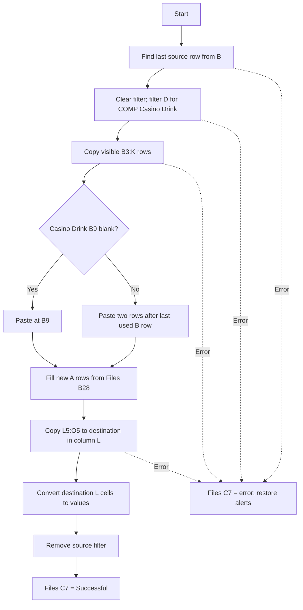
```mermaid
flowchart TD
    A["Start"] --> B["Find last source row from B"]
    B --> C["Clear filter; filter D for COMP Casino Drink"]
    C --> D["Copy visible B3:K rows"]
    D --> E{"Casino Drink B9 blank?"}
    E -- "Yes" --> F["Paste at B9"]
    E -- "No" --> G["Paste two rows after last used B row"]
    F --> H["Fill new A rows from Files B28"]
    G --> H
    H --> I["Copy L5:O5 to destination in column L"]
    I --> J["Convert destination L cells to values"]
    J --> K["Remove source filter"]
    K --> L["Files C7 = Successful"]
    B -. "Error" .-> X["Files C7 = error; restore alerts"]
    C -. "Error" .-> X
    D -. "Error" .-> X
    I -. "Error" .-> X
```

### Important behavior

- The source B:K values and number formats map to target B:K.
- The horizontal four-cell template `L5:O5` is pasted to a one-column vertical
  destination. For multiple output rows, this shape mismatch can cause error
  1004. Data and dates pasted before that failure are not rolled back.
- Only column L is converted to values; formulas pasted into M:O can remain.
- No visible source records can make `SpecialCells(xlCellTypeVisible)` fail.

## CopyFBSheet

**Source:** `exported_vba/FBCOMP.bas` 
**Signature:** `Sub CopyFBSheet()`

### Purpose

Appends rows classified as `COMP Csino-F&B` to `Csino F&B COMP`. The spelling
`Csino` is used exactly this way in both code and sheet names.

```mermaid
flowchart TD
    A["Start"] --> B["Find last source row from B"]
    B --> C["Clear filter; filter D for COMP Csino-F&B"]
    C --> D["Copy visible B3:K rows"]
    D --> E{"Target B11 blank?"}
    E -- "Yes" --> F["Paste at B11"]
    E -- "No" --> G["Paste two rows after last used B row"]
    F --> H["Fill new A rows from Files B28"]
    G --> H
    H --> I["Copy L7:R7 to destination in column L"]
    I --> J["Convert destination L cells to values"]
    J --> K["Remove source filter"]
    K --> L["Files C8 = Successful"]
    B -. "Error" .-> X["Files C8 = error; restore alerts"]
    D -. "Error" .-> X
    I -. "Error" .-> X
```

### Important behavior

- The seven-column template `L7:R7` is pasted to a one-column destination, which
  can fail for multiple output rows.
- Only destination column L is converted to values; M:R can retain formulas.
- Existing filters are destroyed, and partial writes remain after an error.

## CopyHASheet

**Source:** `exported_vba/AMENITY.bas` 
**Signature:** `Sub CopyHASheet()`

### Purpose

Appends rows classified as `COMP Htl Amnty` to `Htl Amenity`.

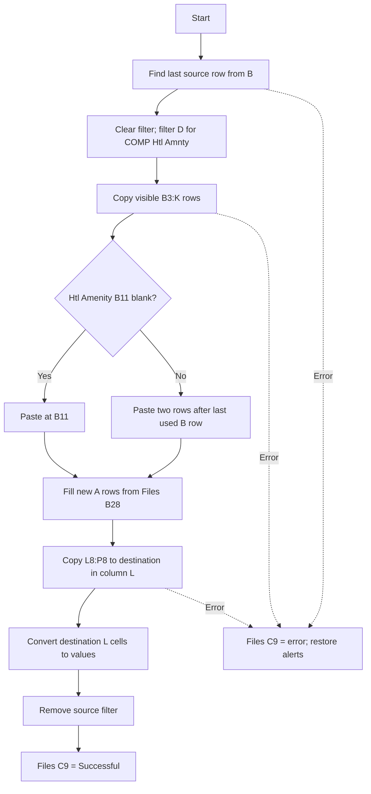
```mermaid
flowchart TD
    A["Start"] --> B["Find last source row from B"]
    B --> C["Clear filter; filter D for COMP Htl Amnty"]
    C --> D["Copy visible B3:K rows"]
    D --> E{"Htl Amenity B11 blank?"}
    E -- "Yes" --> F["Paste at B11"]
    E -- "No" --> G["Paste two rows after last used B row"]
    F --> H["Fill new A rows from Files B28"]
    G --> H
    H --> I["Copy L8:P8 to destination in column L"]
    I --> J["Convert destination L cells to values"]
    J --> K["Remove source filter"]
    K --> L["Files C9 = Successful"]
    B -. "Error" .-> X["Files C9 = error; restore alerts"]
    D -. "Error" .-> X
    I -. "Error" .-> X
```

### Important behavior

- The five-column template `L8:P8` is pasted to a one-column destination, which
  can fail for multiple output rows.
- Only destination column L is converted to values; M:P can retain formulas.
- The routine activates `Htl Amenity` and selects A1.

## CopySPSheet

**Source:** `exported_vba/SPA.bas` 
**Signature:** `Sub CopySPSheet()`

### Purpose

Appends rows classified as `Spa FD Pkg` to `COMP SPA PACKAGE`.

```mermaid
flowchart TD
    A["Start"] --> B["Find last source row from B"]
    B --> C["Clear filter; filter D for Spa FD Pkg"]
    C --> D["Copy visible B3:K rows"]
    D --> E{"Target B9 blank?"}
    E -- "Yes" --> F["Paste at B9"]
    E -- "No" --> G["Paste two rows after last used B row"]
    F --> H["Fill new A rows from Files B28"]
    G --> H
    H --> I["Copy L6 down destination L rows"]
    I --> J["Convert destination L cells to values"]
    J --> K["Remove source filter"]
    K --> L["Files C10 = Successful"]
    B -. "Error" .-> X["Files C10 = error; restore alerts"]
    D -. "Error" .-> X
    I -. "Error" .-> X
```

### Important behavior

- Unlike the other category templates, `L6` is a single cell and naturally
  fills the one-column destination.
- The formula result is frozen without forcing calculation first. In manual
  calculation mode, a stale result can be stored.
- Existing source filter criteria are not preserved.

## CopyOTHERSheet

**Source:** `exported_vba/OTHERS.bas` 
**Signature:** `Sub CopyOTHERSheet()`

### Purpose

Appends source rows whose column-D value matches any nonblank criterion in
`FILTER!C:C` to `OTHERS`.

### Flow

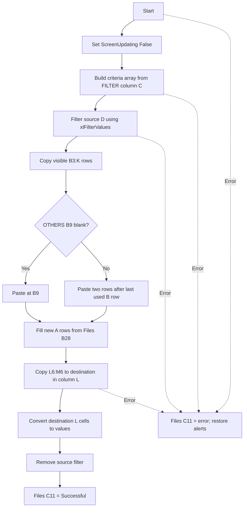
```mermaid
flowchart TD
    A["Start"] --> B["Set ScreenUpdating False"]
    B --> C["Build criteria array from FILTER column C"]
    C --> D["Filter source D using xlFilterValues"]
    D --> E["Copy visible B3:K rows"]
    E --> F{"OTHERS B9 blank?"}
    F -- "Yes" --> G["Paste at B9"]
    F -- "No" --> H["Paste two rows after last used B row"]
    G --> I["Fill new A rows from Files B28"]
    H --> I
    I --> J["Copy L6:M6 to destination in column L"]
    J --> K["Convert destination L cells to values"]
    K --> L["Remove source filter"]
    L --> M["Files C11 = Successful"]
    A -. "Error" .-> X["Files C11 = error; restore alerts"]
    C -. "Error" .-> X
    D -. "Error" .-> X
    J -. "Error" .-> X
```

### Important behavior

- Criteria scanning begins at row 1, so a heading in `FILTER!C1` is also used as
  a criterion.
- The criteria array can contain trailing empty elements when FILTER has blanks.
- Unlike the other category routines, it does not explicitly clear the source's
  existing AutoFilter before applying its filter.
- The two-column template `L6:M6` is pasted to a one-column destination.
- `Application.ScreenUpdating` is disabled and never restored.

## ClearSEM

**Source:** `exported_vba/FClear.bas` 
**Signature:** `Sub ClearSEM()`

### Purpose

Clears `SFR (MTD)` while retaining cell formatting. It shows all filtered data
on `MENU ITEM 2`, `RAW`, and `EMP CLOSED CHECK` without clearing those sheets.

### Actions

| Sheet | Action |
|---|---|
| `SFR (MTD)` | Show all data; clear entire columns A:B, including headers |
| `MENU ITEM 2` | Show all data only; preserve accumulated rows |
| `RAW` | Show all data only; preserve accumulated rows and AP metadata |
| `EMP CLOSED CHECK` | Show all data only; preserve template and accumulated rows |

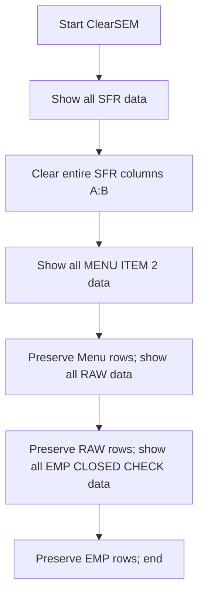
```mermaid
flowchart TD
    A["Start ClearSEM"] --> B["Show all SFR data"]
    B --> C["Clear entire SFR columns A:B"]
    C --> D["Show all MENU ITEM 2 data"]
    D --> E["Preserve Menu rows; show all RAW data"]
    E --> F["Preserve RAW rows; show all EMP CLOSED CHECK data"]
    F --> G["Preserve EMP rows; end"]
```

### Side effects and risks

- The entire SFR A:B columns are cleared, including row 1.
- There is no error handler; an error can stop later unfilter operations.
- Menu, RAW, and EMP data accumulate until another routine or a user removes it.

## Clear

**Source:** `exported_vba/Clearr.bas` 
**Signature:** `Sub Clear()`

### Purpose

Performs a broader reset than `ClearSEM`: it clears SFR and all five category
sheets, but only unfilters `MENU ITEM 2`, `RAW`, and `EMP CLOSED CHECK` so their
accumulated data remains. `ClearContents` preserves formats and validation.

### Actions

| Sheet | Action |
|---|---|
| `SFR (MTD)` | Show all data; clear entire columns A:B |
| `MENU ITEM 2` | Show all data only; preserve accumulated rows |
| `RAW` | Show all data only; preserve accumulated rows and AP metadata |
| `Casino Drink` | Clear `A8:R[last column-A row]` |
| `Csino F&B COMP` | Clear `A10:T[last column-A row]` |
| `Htl Amenity` | Clear `A10:R[last column-A row]` |
| `COMP SPA PACKAGE` | Clear `A8:N[last column-A row]` |
| `OTHERS` | Clear `A8:N[last column-A row]` |
| `EMP CLOSED CHECK` | Show all data only; preserve template and accumulated rows |

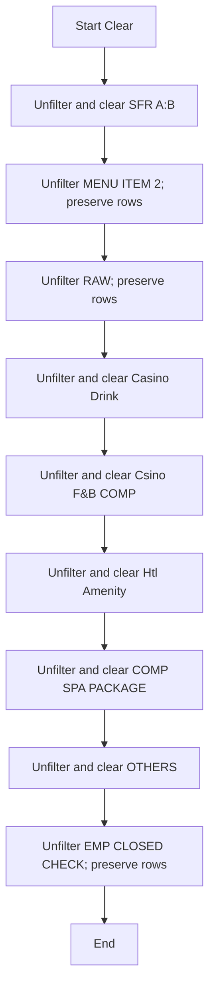
```mermaid
flowchart TD
    A["Start Clear"] --> B["Unfilter and clear SFR A:B"]
    B --> C["Unfilter MENU ITEM 2; preserve rows"]
    C --> D["Unfilter RAW; preserve rows"]
    D --> E["Unfilter and clear Casino Drink"]
    E --> F["Unfilter and clear Csino F&B COMP"]
    F --> G["Unfilter and clear Htl Amenity"]
    G --> H["Unfilter and clear COMP SPA PACKAGE"]
    H --> I["Unfilter and clear OTHERS"]
    I --> J["Unfilter EMP CLOSED CHECK; preserve rows"]
    J --> K["End"]
```

### Side effects and risks

- There is no error handler or rollback. One error stops all later clearing.
- Key-column last-row checks can leave stale cells below the detected boundary.
- The filter criteria are cleared with `ShowAllData`, but filter arrows normally
  remain.
- Menu, RAW, and EMP data are intentionally not cleared by this routine.

## ThisWorkbook module

**Source:** `exported_vba/ThisWorkbook.bas`

This file contains only exported component attributes that identify Excel's
workbook document module. It contains no executable procedures and no workbook
events such as `Workbook_Open`, `Workbook_BeforeClose`, or
`Workbook_SheetChange`. A per-function flowchart is therefore not applicable.

## Important implementation notes

### Shared reliability concerns

- No module contains `Option Explicit`. Undeclared names silently become local
  Variant variables, which makes misspellings harder to detect.
- Several procedures change application-wide settings such as `DisplayAlerts`
  and `ScreenUpdating`. Some paths do not restore those settings.
- External workbooks are not opened read-only, and events are not disabled.
- Error handlers generally report an error but do not close open source
  workbooks, clear filters, undo partial output, or re-raise the error.
- Menu, RAW, and EMP imports retain old destination data by design. Reusing the
  same source files appends duplicate records.
- Many last-row calculations depend on one column and assume contiguous data.
- Several comments in the VBA exports describe different cells or ranges from
  those actually used. This document follows the executable code.

### Recommended operating order

The existing code does not enforce this order, but it best matches its data
dependencies:

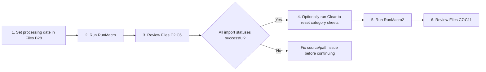
```mermaid
flowchart LR
    A["1. Set processing date in Files B28"] --> B["2. Run RunMacro"]
    B --> C["3. Review Files C2:C6"]
    C --> D{"All import statuses successful?"}
    D -- "Yes" --> E["4. Optionally run Clear to reset category sheets"]
    D -- "No" --> F["Fix source/path issue before continuing"]
    E --> G["5. Run RunMacro2"]
    G --> H["6. Review Files C7:C11"]
```

This sequence is documentation only; the VBA code does not automate or enforce
it.
