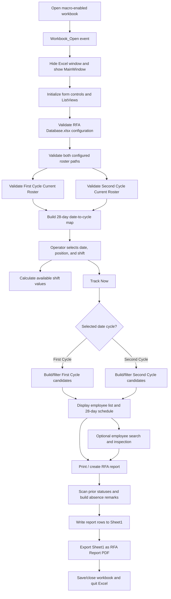
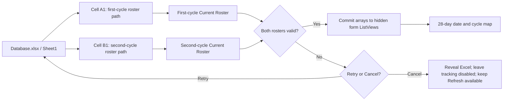
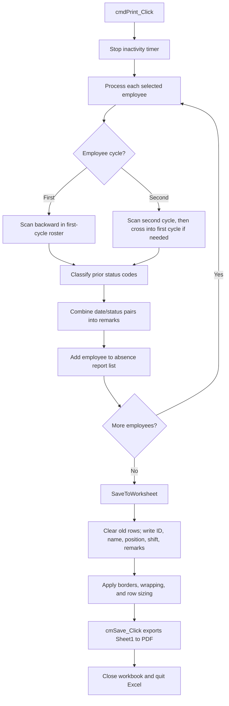
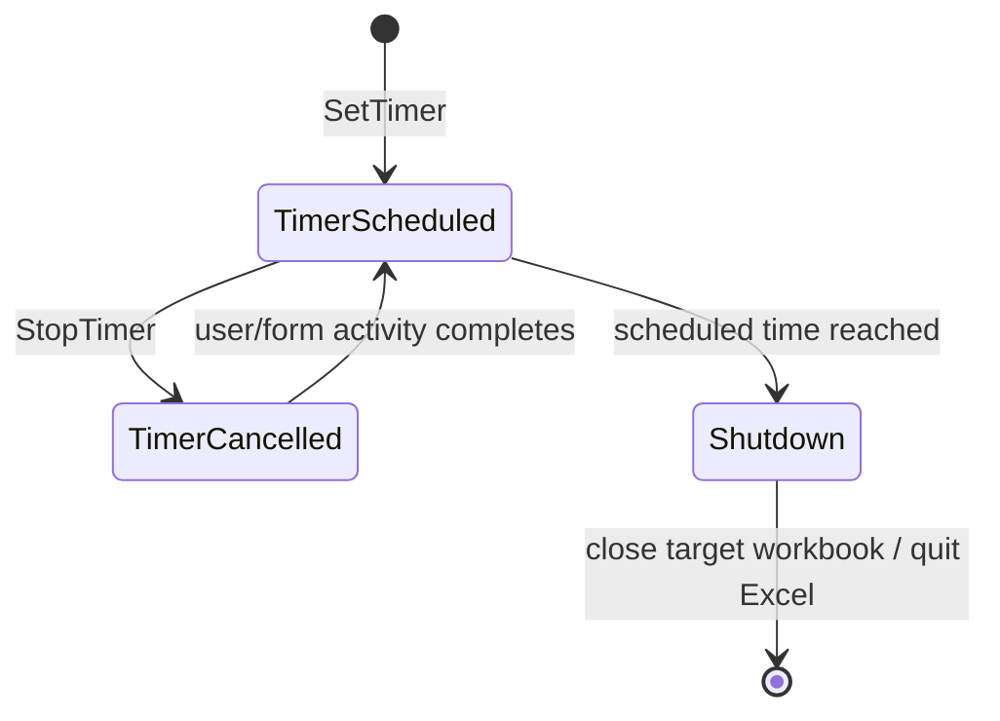
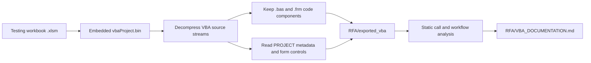

# RFA VBA Process Documentation

**Source workbook:** `Testing/Employee Tracking System V6.0.xlsm`  
**Export folder:** `RFA/exported_vba`  
**Analysis method:** Static inspection only; the macros were not run in Excel.

**Repository safety:** Plaintext password values retained inside the ignored workbook were replaced with `<REDACTED>` in the tracked VBA export before commit. VBA project protection remains enabled in the V6.0 workbook.

The workbook is an Employee Tracking System (ETS) that produces Return From Absence (RFA) reports. Its executable VBA self-references use `ThisWorkbook` rather than a version-specific filename, so future file renames do not require code changes.

## Purpose

The VBA application loads two employee roster cycles, lets an operator select a date, position, and shift, identifies employees relevant to that selection, builds absence-history remarks, writes the report to the workbook, and exports an RFA PDF to a network folder.

The application is built primarily around the `MainWindow` UserForm. Excel is hidden during normal operation, so the form acts as the user-facing application.

## End-to-End Process

## Startup and Data Loading

The workbook class module contains the startup events. It is not present as a standalone `.cls` file because the export follows the repository's trimmed Budget format, which retains standard modules and UserForm code only.

1. `Workbook_Open` hides Excel, disables screen updates and alerts, hides the current workbook window through `ThisWorkbook.Windows(1)`, and displays `MainWindow`. An unexpected startup error restores Excel and reports the captured cause.
2. `UserForm_Initialize` configures the visible and hidden ListView controls, disables tracking and report output, and calls `LoadStartupDataWithRetry`.
3. `TryLoadConfiguration` verifies that the network-hosted `Database.xlsx` file exists, contains `Sheet1`, and provides nonblank, accessible first- and second-cycle roster paths in cells A1 and B1.
4. `TryLoadRoster` opens each roster read-only and verifies that it contains a `Current Roster` worksheet, a region of at least 3 rows by 16 columns, a valid cycle start date in C2, and at least one employee beginning on row 3.
5. Both roster ranges are read into arrays before any visible or hidden form data is cleared. Only after both sources pass does `PopulateRosterControls` replace the form data and build the 28-day, two-cycle date map.
6. The loader restores Excel application flags and enables tracking and the inactivity timer only after a complete successful load.

Validation is all-or-nothing: a missing or invalid source never clears previously loaded form data. Error dialogs identify the configuration or roster role, show the full failing path, describe the Excel error when one is available, and state the corrective action. Retry runs the same validation again. Cancel closes any partially opened source workbook, restores Excel visibility and application state, stops the timer, disables tracking, and leaves Refresh enabled so the operator can retry later.

## Selection and Tracking

The operator works with three main selectors:

- **Date:** mapped to a roster column and either the first or second cycle.
- **Position:** All, Dealer, Pit Supervisor, or Pit Manager.
- **Shift:** All, Morning, Day, Late Day, Night, or Late Night.

Changing any selector stops the inactivity timer, recalculates available shifts through `CallShiftStarts`, and restarts the timer. The available-shift logic delegates to `LookForRecordFirstForShifting` or `LookForRecordSecondForShifting` according to the selected cycle.

`cmdTrackNow_Click` is the main tracking entry point. It:

1. Resolves the selected date to a roster column and cycle.
2. Clears previous results and display state.
3. Calls `FirstCycle` or `SecondCycle` to build an in-memory employee set.
4. Calls `LookForRecordFirst` or `LookForRecordSecond` to filter the set by roster status, position, shift, and prior absence rules.
5. Selects the first result, loads the employee's schedule, fills the 28 date labels, and enables report generation when results exist.
6. Writes the chosen date to `Sheet1!X1`, hides Excel again, and restarts the inactivity timer.

The form uses numeric four-digit values as working shift start times. Non-numeric values are treated as roster status codes. The code distinguishes absence-type values from rest, leave, and other non-working statuses when deciding which employees and historical remarks to include.

## Employee Review

`lvListTrainee_Click` and `LoadData` display the selected employee's ID, name, position, and 28-day roster values. `LoadColor` highlights the date associated with the selected result.

`txtSearch_Change` searches the current result list as the operator types. A match becomes the selected employee and refreshes the detail display. No match produces an ETS message and clears the search field.

`cmdRefresh_Click` uses the same all-or-nothing loader as startup. On success it replaces both roster data sets, rebuilds the selectors, attempts to restore today's date, and restarts the inactivity timer. On failure it offers Retry or Cancel without first clearing the current form data.

## RFA Report Generation

`cmdPrint_Click` does not send output directly to a printer. It builds an RFA data set by scanning backward through each employee's roster history. For a second-cycle date, the scan can continue into the prior first-cycle roster.

`SaveToWorksheet` prepares `Sheet1` as follows:

- Writes the report date and selected shift to cells in column G.
- Clears old report rows starting at row 7.
- Writes employee ID, name, position, shift, and combined absence remarks.
- Applies borders, row height, and text wrapping.
- Calls `cmSave_Click` after the sheet is ready.

`Sheet1` is the built-in report template. Its fixed column headers are `ID#`, `NAME OF EMPLOYEE`, `ROLE`, `SHIFT`, `REMARKS`, `Staff Signature`, and the two-line `Manager/Admin` / `Signature` approval header. The macros populate and format the rows beneath those headers; no separate report-template file is loaded.

`cmSave_Click` exports `Sheet1` to the configured RFA network output folder. An `All Shift` report, or any report containing more than one distinct nonblank shift, uses the date-only name `RFA Report d-mmm-yy.pdf`. A report containing exactly one shift appends that shift to the filename. An existing target PDF is replaced. If replacement or export fails, Excel is restored and the operator receives an error instead of the workbook closing silently.

## Timer and Shutdown Behavior

`Module3` provides a five-hour-and-ten-minute inactivity timer using `Application.OnTime`.

Many form events cancel and reschedule this timer. The workbook class also resets it after worksheet calculation and selection changes. `Workbook_BeforeClose` cancels the scheduled callback.

## Component Inventory

| Component | Type | Main responsibility |
|---|---|---|
| `MainWindow.frm` | UserForm | UI, roster loading, selection, employee filtering, history scanning, report creation, and PDF export |
| `Module1.bas` | Standard module | Adds minimize/maximize styles to the UserForm window through Windows APIs |
| `Module2.bas` | Standard module | Makes the UserForm appear as a taskbar application through Windows APIs |
| `Module3.bas` | Standard module | Schedules, cancels, and performs inactivity shutdown |
| `PROJECT.txt` | Project metadata | VBA project identity and component declarations |
| `manifest.json` | Export metadata | Component sizes, procedure count, form-control inventory, and direct calls |
| `references.txt` | Reference placeholder | Matches the trimmed Budget export layout |

The retained components contain 68 procedures and 125 detected form controls.

## Important Procedure Groups

| Area | Procedures |
|---|---|
| Form lifecycle | `UserForm_Initialize`, `UserForm_Activate`, `UserForm_QueryClose`, `UserForm_Terminate` |
| Configuration and import | `LoadStartupDataWithRetry`, `TryLoadStartupData`, `TryLoadConfiguration`, `TryLoadRoster`, `PopulateRosterControls`, `InitializeFilterChoices`, `SelectDefaultDate` |
| Selector reactions | `cmbDate_Change`, `cmbPosition_Change`, `cmbShift_Change`, `CallShiftStarts` |
| Main tracking | `cmdTrackNow_Click`, `FirstCycle`, `SecondCycle`, `LookForRecordFirst`, `LookForRecordSecond` |
| Available shifts | `LookForRecordFirstForShifting`, `LookForRecordSecondForShifting` |
| Employee display | `lvListTrainee_Click`, `LoadData`, `LoadColor`, `FillAll`, `ClearAll` |
| Search and refresh | `txtSearch_Change`, `cmdRefresh_Click` |
| Reporting | `cmdPrint_Click`, `SaveToWorksheet`, `cmSave_Click` |
| Window integration | `AddToForm`, `AppTasklist` |
| Timer | `SetTimer`, `StopTimer`, `ShutDown` |

Several empty, commented-out, or test-oriented handlers remain in the project, including `cmdInsert_Click`, `cmdInsertFile_Click`, `cmdTrackEmpSL_Click`, `ThisIsForATest`, `Sample`, and unused button events. They are not part of the primary production flow above.

## External Dependencies

- Microsoft Excel with macros enabled.
- Windows; the project calls `user32.dll` and uses Windows-specific window handles and styles.
- Microsoft ListView/Common Controls support used by the form's ListView controls.
- Access to the internal network configuration workbook, both roster workbooks, and the RFA output share.
- A `Current Roster` worksheet with the layout expected by the positional ListView logic.
- A report template on `Sheet1`, including the cells used for the report date, shift, and output filename.

## Risks and Maintenance Notes

1. **Embedded credential:** A workbook/worksheet password is hard-coded in the original VBA. It should be removed from source code and supplied through an approved secure mechanism.
2. **Network coupling:** Configuration, roster loading, and PDF output depend on internal network paths. There is no offline fallback.
3. **Broad Excel shutdown:** Several routines call `Application.Quit`, which can close the entire Excel instance rather than only this workbook.
4. **Legacy error handling outside startup:** Startup and roster refresh now use contextual cleanup and Retry/Cancel recovery, but some unrelated legacy handlers still suppress errors or show only a generic message.
5. **Unqualified Excel objects:** Several `Cells`, `Rows`, `Range`, and `Sheets` references rely on whichever workbook or worksheet is active.
6. **64-bit API declarations:** The declarations are marked `PtrSafe`, but window handles are stored as `Long` rather than `LongPtr`; this can be unsafe in 64-bit Office.
7. **Time-window boundaries:** Shift filters use mixed string/numeric comparisons and strict greater-than/less-than bounds, which can exclude exact boundary times.
8. **Large monolithic form:** Most business logic is embedded in `MainWindow.frm`, making testing, reuse, and isolated maintenance difficult.
9. **Static-analysis limitation:** Control bindings, `Application.OnTime`, workbook events, and any dynamically resolved calls are not fully represented by direct-call scanning.

## Export Process

The documentation and source files were produced without executing the macros:

Worksheet and workbook `.cls` modules and binary UserForm payloads were omitted to match the current trimmed exports under `Budget`. The original `.xlsm` remains the authoritative artifact for designer layout, embedded controls, and workbook/worksheet class events.
