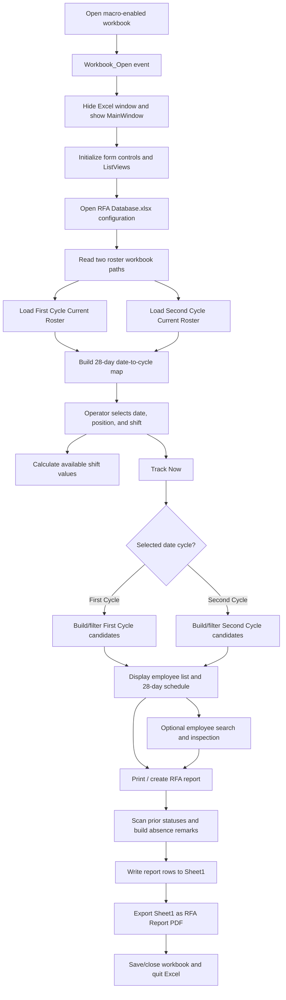
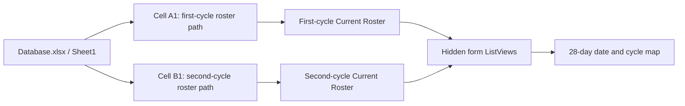
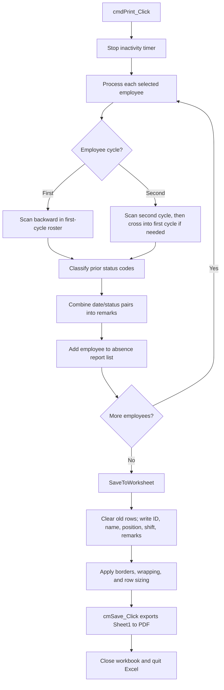
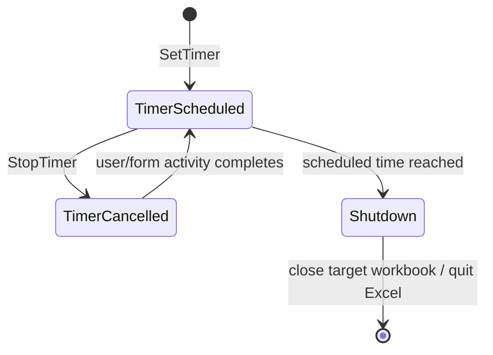
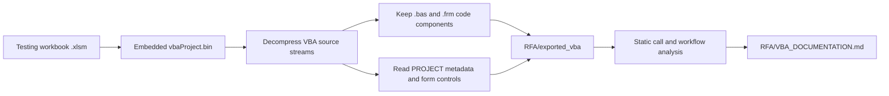

# RFA VBA Process Documentation

**Source workbook:** `Testing/Jorunal Template v3.xlsm`  
**Export folder:** `RFA/exported_vba`  
**Analysis method:** Static inspection only; the macros were not run in Excel.

**Repository safety:** Plaintext password values present in the source workbook were replaced with `<REDACTED>` in the exported VBA before commit. The original workbook remains unchanged in the ignored `Testing` folder.

The workbook filename says “Jorunal Template,” but the embedded VBA identifies the application as an Employee Tracking System (ETS) and produces Return From Absence (RFA) reports. This documentation describes the behavior found in the VBA, not the apparent purpose implied by the filename.

## Purpose

The VBA application loads two employee roster cycles, lets an operator select a date, position, and shift, identifies employees relevant to that selection, builds absence-history remarks, writes the report to the workbook, and exports an RFA PDF to a network folder.

The application is built primarily around the `MainWindow` UserForm. Excel is hidden during normal operation, so the form acts as the user-facing application.

## End-to-End Process

## Startup and Data Loading

The workbook class module contains the startup events. It is not present as a standalone `.cls` file because the export follows the repository's trimmed Budget format, which retains standard modules and UserForm code only.

1. `Workbook_Open` hides Excel, disables screen updates and alerts, hides a specifically named Employee Tracking System workbook window, and displays `MainWindow`.
2. `UserForm_Initialize` configures the visible and hidden ListView controls, disables report output until data is selected, and starts data loading.
3. `CallDatabaseLoc` opens a network-hosted `Database.xlsx` file and reads two workbook locations from the first row of `Sheet1`.
4. `LoadDataFromExcel` populates the shift and position selectors and chooses a default shift based on the current time.
5. `ReadDataFromCloseFile` opens both configured roster workbooks as read-only, reads each `Current Roster` region into a hidden ListView, then creates a 28-day date list divided into two 14-day cycles.

## Selection and Tracking

The operator works with three main selectors:

- **Date:** mapped to a roster column and either the first or second cycle.
- **Position:** All, Dealer, Pit Supervisor, or Pit Manager.
- **Shift:** All, Morning, Day, Late Day, Night, or Late Night.

Changing any selector stops the inactivity timer, recalculates available shifts through `CallShiftStarts`, and restarts the timer. The available-shift logic delegates to `LookForRecordFirstForShifting` or `LookForRecordSecondForShifting` according to the selected cycle.

`cmdTrackNow_Click` is the main tracking entry point. It:

1. Resolves the selected date to a roster column and cycle.
2. Clears previous results and display state.
3. Calls `FirstCycle` or `SecondCycle` to build an in-memory employee set.
4. Calls `LookForRecordFirst` or `LookForRecordSecond` to filter the set by roster status, position, shift, and prior absence rules.
5. Selects the first result, loads the employee's schedule, fills the 28 date labels, and enables report generation when results exist.
6. Writes the chosen date to `Sheet1!X1`, hides Excel again, and restarts the inactivity timer.

The form uses numeric four-digit values as working shift start times. Non-numeric values are treated as roster status codes. The code distinguishes absence-type values from rest, leave, and other non-working statuses when deciding which employees and historical remarks to include.

## Employee Review

`lvListTrainee_Click` and `LoadData` display the selected employee's ID, name, position, and 28-day roster values. `LoadColor` highlights the date associated with the selected result.

`txtSearch_Change` searches the current result list as the operator types. A match becomes the selected employee and refreshes the detail display. No match produces an ETS message and clears the search field.

`cmdRefresh_Click` reloads both roster sources, rebuilds the selectors, attempts to restore today's date, and resets the inactivity timer.

## RFA Report Generation

`cmdPrint_Click` does not send output directly to a printer. It builds an RFA data set by scanning backward through each employee's roster history. For a second-cycle date, the scan can continue into the prior first-cycle roster.

`SaveToWorksheet` prepares `Sheet1` as follows:

- Writes the report date and selected shift to cells in column G.
- Clears old report rows starting at row 7.
- Writes employee ID, name, position, shift, and combined absence remarks.
- Applies borders, row height, and text wrapping.
- Calls `cmSave_Click` after the sheet is ready.

`cmSave_Click` exports `Sheet1` as a PDF named from `RFA Report` plus the value in `Sheet1!Y1`. The file is written to the configured RFA network output folder. The routine then saves and closes the workbook and quits Excel.

## Timer and Shutdown Behavior

`Module3` provides a five-hour-and-ten-minute inactivity timer using `Application.OnTime`.

Many form events cancel and reschedule this timer. The workbook class also resets it after worksheet calculation and selection changes. `Workbook_BeforeClose` cancels the scheduled callback.

## Component Inventory

| Component | Type | Main responsibility |
|---|---|---|
| `MainWindow.frm` | UserForm | UI, roster loading, selection, employee filtering, history scanning, report creation, and PDF export |
| `Module1.bas` | Standard module | Adds minimize/maximize styles to the UserForm window through Windows APIs |
| `Module2.bas` | Standard module | Makes the UserForm appear as a taskbar application through Windows APIs |
| `Module3.bas` | Standard module | Schedules, cancels, and performs inactivity shutdown |
| `PROJECT.txt` | Project metadata | VBA project identity and component declarations |
| `manifest.json` | Export metadata | Component sizes, procedure count, form-control inventory, and direct calls |
| `references.txt` | Reference placeholder | Matches the trimmed Budget export layout |

The retained components contain 56 procedures and 125 detected form controls.

## Important Procedure Groups

| Area | Procedures |
|---|---|
| Form lifecycle | `UserForm_Initialize`, `UserForm_Activate`, `UserForm_QueryClose`, `UserForm_Terminate` |
| Configuration and import | `CallDatabaseLoc`, `LoadDataFromExcel`, `ReadDataFromCloseFile` |
| Selector reactions | `cmbDate_Change`, `cmbPosition_Change`, `cmbShift_Change`, `CallShiftStarts` |
| Main tracking | `cmdTrackNow_Click`, `FirstCycle`, `SecondCycle`, `LookForRecordFirst`, `LookForRecordSecond` |
| Available shifts | `LookForRecordFirstForShifting`, `LookForRecordSecondForShifting` |
| Employee display | `lvListTrainee_Click`, `LoadData`, `LoadColor`, `FillAll`, `ClearAll` |
| Search and refresh | `txtSearch_Change`, `cmdRefresh_Click` |
| Reporting | `cmdPrint_Click`, `SaveToWorksheet`, `cmSave_Click` |
| Window integration | `AddToForm`, `AppTasklist` |
| Timer | `SetTimer`, `StopTimer`, `ShutDown` |

Several empty, commented-out, or test-oriented handlers remain in the project, including `cmdInsert_Click`, `cmdInsertFile_Click`, `cmdTrackEmpSL_Click`, `ThisIsForATest`, `Sample`, and unused button events. They are not part of the primary production flow above.

## External Dependencies

- Microsoft Excel with macros enabled.
- Windows; the project calls `user32.dll` and uses Windows-specific window handles and styles.
- Microsoft ListView/Common Controls support used by the form's ListView controls.
- Access to the internal network configuration workbook, both roster workbooks, and the RFA output share.
- A `Current Roster` worksheet with the layout expected by the positional ListView logic.
- A report template on `Sheet1`, including the cells used for the report date, shift, and output filename.

## Risks and Maintenance Notes

1. **Workbook-name mismatch:** The attached filename differs from the Employee Tracking System names hard-coded throughout the VBA. Renaming or replacing the workbook can cause `Windows(...)` and `Workbooks(...)` lookups to fail.
2. **Version mismatch:** Most form code targets an Employee Tracking System V5.0 filename, while the shutdown module targets V1.0. The scheduled shutdown may therefore act on the wrong workbook or raise an error.
3. **Embedded credential:** A workbook/worksheet password is hard-coded in the VBA. It should be removed from source code and supplied through an approved secure mechanism.
4. **Network coupling:** Configuration, roster loading, and PDF output depend on internal network paths. There is no offline fallback.
5. **Broad Excel shutdown:** Several routines call `Application.Quit`, which can close the entire Excel instance rather than only this workbook.
6. **Error handling:** Some handlers suppress errors or only show a generic message. Partial loads can leave Excel hidden or application flags in an unexpected state.
7. **Unqualified Excel objects:** Several `Cells`, `Rows`, `Range`, `Sheets`, and `Windows` references rely on whichever workbook or worksheet is active.
8. **64-bit API declarations:** The declarations are marked `PtrSafe`, but window handles are stored as `Long` rather than `LongPtr`; this can be unsafe in 64-bit Office.
9. **Time-window boundaries:** Shift filters use mixed string/numeric comparisons and strict greater-than/less-than bounds, which can exclude exact boundary times.
10. **Large monolithic form:** Most business logic is embedded in `MainWindow.frm`, making testing, reuse, and isolated maintenance difficult.
11. **Static-analysis limitation:** Control bindings, `Application.OnTime`, workbook events, and any dynamically resolved calls are not fully represented by direct-call scanning.

## Export Process

The documentation and source files were produced without executing the macros:

Worksheet and workbook `.cls` modules and binary UserForm payloads were omitted to match the current trimmed exports under `Budget`. The original `.xlsm` remains the authoritative artifact for designer layout, embedded controls, and workbook/worksheet class events.
